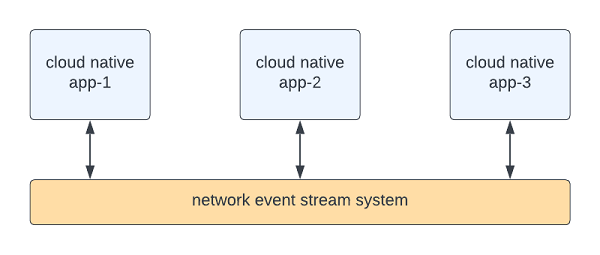
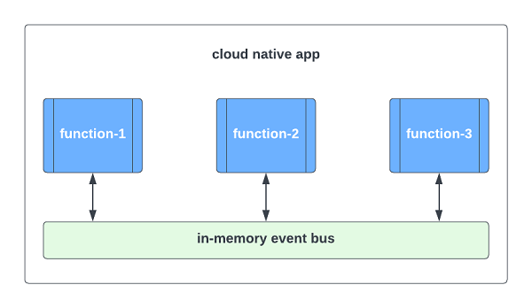
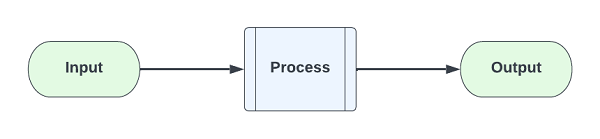
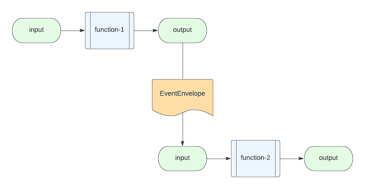
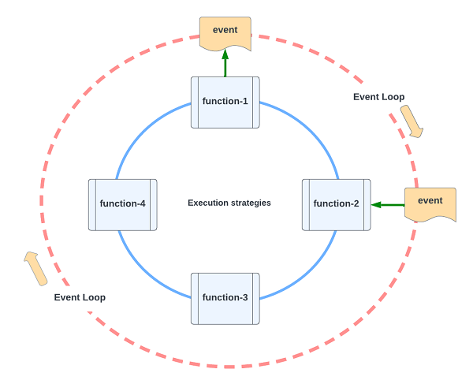
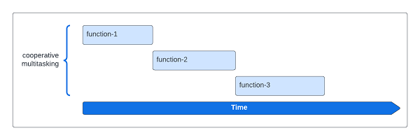
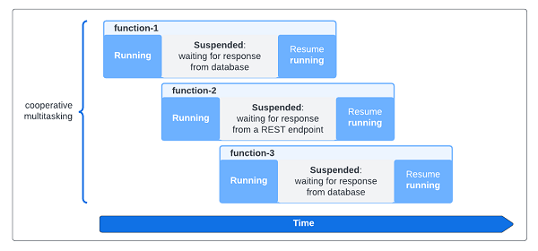
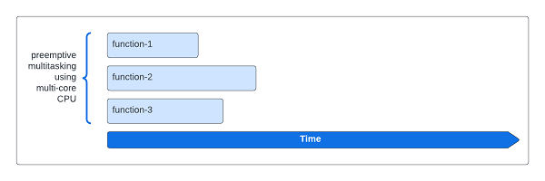

# Mercury 3.1

Reference engine for building "Composable architecture and applications".

# Pre-requisite

This project leverages the power of Java version 21 (LTS) virtual thread feature.

Inside a single method, your code is running sequentially and synchronous request-response (RPC) calls
operate exactly as intended. However, your function is suspended when waiting for a response from another
function, database query or an external resource, thus reducing CPU consumption and dramatically
increasing application throughput to handle more transactions and users.

If you need compatibility with lower Java version down to version 1.8, please visit
Mercury 3.0 in https://github.com/Accenture/mercury

# Welcome to the Mercury project

The Mercury project is created with one primary objective -
`to make software easy to write, read, test, deploy, scale and manage.`

Mercury is the building block for writing event driven composable applications.
It is applicable for both green field system development and IT modernization projects.

A legacy application may be modernized in 3 steps:

1. _Decompose_
2. _Encapsulate_
3. _Reinvent_

Mercury can be used to **decompose** a large monolithic application into functional blocks where each legacy functional
block can be **encapsulated** in a functional wrapper that is fully event driven. Once functional boundary is
identified, a set of functions can be grouped and deployed as a microservices unit. The deployed services can
communicate with each other in events over the network. The end result is a set of cloud native services.

Since each function is coupled with an event system, the amount of code within a functional wrapper is relatively
small and we can refactor or **rewrite** some logic using modern coding style. There is no restriction in coding
style inside a functional wrapper. You can write sequential code, object oriented code or reactive code.

In this fashion, you can keep legacy code that is trouble free and focus your energy to re-invent the application
selectively and incrementally.

With Mercury 3.1, you have complete control to precisely tune your application for optimal performance and throughput
using three function execution strategies:

1. _Virtual thread_ - this is the default execution style for a functional block
2. _Suspend function_ - if you prefer coding in Kotlin, this allows you to define a function as a "coroutine" that is
   comparable to Java virtual thread.
3. _Kernel thread pool_ - you can define a function to run in a kernel thread pool for computational intensive task
   or legacy code that must run in a kernel thread

January 2024

# Write your first composable application

To get started with your first application, please refer to the [Developer Guide](guides/CHAPTER-1.md).

# Introduction to composable architecture

In cloud migration and IT modernization, we evaluate application portfolio and recommend different
disposition strategies based on the 7R migration methodology.
```text
7R: Retire, retain, re-host, re-platform, replace, re-architect and re-imagine.
```

The most common observation during IT modernization discovery is that there are many complex monolithic applications
that are hard to modernize quickly.

IT modernization is like moving into a new home. It would be the opportunity to clean up and to improve for
business agility and strategic competitiveness.

Composable architecture is gaining visibility recently because it accelerates organization transformation towards
a cloud native future. We will discuss how we may reduce modernization risks with this approach.

# Composability

Composability applies to both platform and application levels.

We can trace the root of composability to Service Oriented Architecture (SOA) in 2000 or a technical bulletin on
"Flow-Based Programming" by IBM in 1971. This is the idea that architecture and applications are built using
modular building blocks and each block is self-contained with predictable behavior.

At the platform level, composable architecture refers to loosely coupled platform services, utilities, and
business applications. With modular design, you can assemble platform components and applications to create
new use cases or to adjust for ever-changing business environment and requirements. Domain driven design (DDD),
Command Query Responsibility Segregation (CQRS) and Microservices patterns are the popular tools that architects
use to build composable architecture. You may deploy applications in containers, serverless or other means.

At the application level, a composable application means that an application is assembled from modular software
components or functions that are self-contained and pluggable. You can mix-n-match functions to form new applications.
You can retire outdated functions without adverse side effect to a production system. Multiple versions of a function
can exist, and you can decide how to route user requests to different versions of a function. Applications would be
easier to design, develop, maintain, deploy, and scale.

Composable architecture and applications contribute to business agility.

# Building a composable application

## Microservices

Since 2014, microservices architectural pattern helps to decompose a big application into smaller pieces of
“self-contained” services. We also apply digital decoupling techniques to services and domains. Smaller is better.
However, we are writing code in the same old fashion. One method is calling other methods directly. Functional and
reactive programming techniques are means to run code in a non-blocking manner, for example Reactive Streams, Akka,
Vertx, Quarkus Multi/Uni and Spring Reactive Flux/Mono. These are excellent tools, but they do not reduce the
complexity of business applications.

## Composable application

To make an application composable, the software components within a single application should be loosely coupled
where each component has zero or minimal dependencies.

Unlike traditional programming approach, composable application is built from the top down. First, we describe
a business transaction as an event flow. Second, from the event flow, we identify individual functions for
business logic. Third, we write user story for each function and write code in a self-contained manner.
Finally, we write orchestration code to coordinate event flow among the functions, so they work together
as a single application.

The individual functions become the building block for a composable application. We can mix-n-match different
sets of functions to address different business use cases.

# Event is the communication conduit

Cloud native applications are deployed as containers or serverless functions. Ideally, they communicate using events.
For example, the CQRS design pattern is well accepted for building high performance cloud native applications.

> Figure 1 - Cloud native applications use event streams to communicate




However, within a single application unit, the application is mostly built in a traditional way.
i.e. one function is calling other functions and libraries directly, thus making the modules and libraries
tightly coupled. As a result, microservices may become smaller monolithic applications.

To overcome this limitation, we can employ “event-driven design” to make the microservices application unit composable.

An application unit is a collection of functions in memory and an “event bus” is the communication conduit to connect
the functions together to form a single executable.

> Figure 2 – Functions use in-memory event bus to communicate



# In-memory event bus

For a composable application, each function is written using the first principle of “input-process-output” where
input and output payloads are delivered as events. All input and output are immutable to reduce unintended bugs
and side effects.

Since input and output for each function is well-defined, test-driven development (TDD) can be done naturally.
It is also easier to define a user story for each function and the developer does not need to study and integrate
multiple levels of dependencies, resulting in higher quality code.

> Figure 3 - The first principle of a function



What is a “function”? For example, reading a record from a database and performing some data transformation,
doing a calculation with a formula, etc.

> Figure 4 - Connecting output of one function to input of another



As shown in Figure 4, if function-1 wants to send a request to function-2, we can write “event orchestration code”
to put the output from function-1 into an event envelope and send it over an in-memory event bus. The event system
will transport the event envelope to function-2, extract the payload and submit it as “input” to function-2

# Function execution strategy

In event-driven application design, a function is executed when an event arrives as “input.” When a function
finishes processing, your application can command the event system to route the result set (“output”) as an
event to another function.

> Figure 5 - Executing function through event flow



As shown in Figure 5, functions can send/receive events using an in-memory event bus (aka "event loop").

This event-driven architecture provides the foundation to design and implement composable applications.
Each function is self-contained and loosely coupled by event flow.

A function receiving an event needs to be executed. There are three ways to do that:

1. _Virtual thread_
2. _Suspend function_
3. _Kernel thread pool_

## Virtual thread

Many modern programming languages such as GoLang, Kotlin, Python and Node.js support “cooperative multitasking”
using “event loop” or “coroutine.” Instead of context switching at the kernel level, functions are executed orderly
by yielding to each other. The order of execution depends on the event flow of each business transaction.

Since the functions are running cooperatively, the overheads of context switching are low. “Event loop” or
“Coroutine” technology usually can support tens of thousands of “functions” running in “parallel.”
Technically, the functions are running sequentially. When each function finishes execution very quickly,
they appear as running concurrently.

In Java 19, the virtual thread feature was introduced as an experimental feature. 
It is officially supported in Java 21 LTS. 

Virtual thread is more than coroutine. It is comparable to Kotlin suspend function that we will discuss below.
However, it is implemented in the "Thread" API of the standard library, therefore reducing code complexity.

> Figure 6 - Cooperative multitasking



## “Suspend function”

In a typical enterprise application, many functions are waiting for responses most of the time.
In preemptive multitasking, these functions are using kernel threads and consuming CPU time.
Too many active kernel threads would turn the application into slow motion.

“Suspend function” not only avoids overwhelming the CPU with excessive kernel threads but also leverages the
synchronous request-response opportunity into high throughput non-blocking operation.

As the name indicates, “suspend function” can be suspended and resumed. When it is suspended, it yields control
to the event loop so that other coroutines or suspend functions can run.

In Node.js and GoLang, coroutine and suspend function are the same. Suspend function refers to the “async/await”
keywords or API of coroutine. In Kotlin, the suspend function extends a coroutine to have the suspend/resume ability.

A function is suspended when it is waiting for a response from the network, a database or from another function.
It is resumed when a response is received.

> Figure 7 - Improving throughput with suspend function



As shown in Figure 8, a “suspend function” can suspend and resume multiple times during its execution.
When it suspends, it is not using any CPU time, thus the application has more time to serve other functions.
This mechanism is very efficient that it can significantly increase the throughput of the application.
i.e. it can handle many concurrent users, and process more requests.

## Kernel thread pool

Java supports “preemptive multitasking” using kernel threads. Multiple functions can execute in parallel.
Preemptive multitasking leverages the multiple cores of a CPU to yield higher performance.

Preemptive multitasking is performed at the kernel level and the operating system is doing the context switching.
As a result, the maximum number of kernel threads is small. As a rule of thumb, a moderately fast computer can
support ~200 kernel threads.

In Mercury 3.1, the default execution mode of a user function is "virtual thread". To use kernel thread pool for
a user function, you must add the "KernelThreadRunner" annotation explicitly.

> Figure 8 - Multitasking of kernel threads at the hardware and OS level



# Performance and throughput

The ability to select an optimal function execution strategy for a function is critical to the success of a
composable application. This allows the developer to have low level control of how the application performs and scales.

Without an optimal function execution strategy, performance tuning is usually an educated guess.

In composable application architecture, each function is self-contained and stateless. We can predict the performance
of each function by selecting an optimal function execution strategy and evaluate it with unit tests and observability.
Predicting application performance and throughput at design and development time reduces modernization risks.

The pros and cons of each function execution strategy are summarized below:

| Strategy         | Advantage                                                                                                    | Disadvantage                                                                   |
|:-----------------|:-------------------------------------------------------------------------------------------------------------|:-------------------------------------------------------------------------------|
| Virtual thread   | Highest throughput in terms of<br/>concurrent users. Functionally<br/>similar to a suspend function.         | N/A                                                                            |
| Suspend function | Sequential "non-blocking" for<br/>RPC (request-response) that<br/>makes code easier to read and<br/>maintain | Requires coding in Kotlin language                                             |
| Kernel threads   | Highest performance in terms of<br/>operations per seconds                                                   | Lower number of concurrent threads<br/>due to high context switching overheads |

As shown in the table above, performance and throughput are determined by function execution strategies.

For example, single threaded event driven network proxies such as nginx support twenty times more concurrent 
connections than multithreading application servers.

# The best of both worlds

If we simplify event-driven programming and support all three function execution strategies, we can design and 
implement composable applications that deliver high performance and high throughput.

The “virtual thread” feature in Java 21 is a good building block for function execution strategies. It is the most
significant technological advancement for Java. It supports non-blocking sequential programming without 
explicitly using the “async” and “await” keywords. As a result, we believe that all current open sources libraries
that provide event loop functionality would evolve.

To accelerate this evolution, we have implemented Mercury version 3.1 as an accelerator to build composable 
applications. It supports the two pillars of composable application – In-memory event bus and selection of 
function execution strategies.

It integrates with Eclipse Vertx to hide the complexity of event-driven programming and embraces the three function 
execution strategies using virtual thread, suspend function and kernel thread pool.

We can construct a composable application with self-contained functions that execute when events arrive. 
There is a simple event API that we call the “Post Office” to support sequential non-blocking RPC, async, 
drop and forget, callback, workflow, pipeline, streaming and interceptor patterns.

Sequential non-blocking RPC reduces the effort in application modernization because we can directly port sequential 
legacy code from a monolithic application to the new composable cloud native design.

Earlier we discussed “event orchestration.” We have an accelerator called “Event Script” that provides 
“event orchestration” in configuration to eliminate the most tedious coding effort. Event Script creates a 
composable application in three steps: (1) the product owner and architect describe the business transaction as 
a flow of events, (2) the developer converts the flow chart into event script and (3) write the individual 
functions for business logic. The system will connect the various functions together and orchestrate the 
event flow as a single application.

# What is "event orchestration"?

In traditional programming, we write code to make calls to different methods and libraries. In event-driven 
programming, we write code to send events, and this is “event orchestration.” We can use events to make RPC call 
just like traditional programming. It is viable to port legacy orchestration logic into event orchestration code.

To further reduce coding effort, we can use Event Script to do “event orchestration.” This would replace code with 
simple event flow configuration.

```text
Note: Event Script is outside the scope of this open sources project.
      Please contact your Accenture representative if you are interested to use
      Event Script to further reduce coding effort for composable applications.
```

# How steep is the learning curve for a developer?

The developer can use any coding style to write the individual functions, no matter it is sequential, object-oriented,
or reactive. One may use any favorite frameworks or libraries. There are no restrictions.

There is a learning curve in writing “event orchestration.” Since event orchestration supports sequential 
non-blocking RPC, the developer can port existing legacy code to the modern style with direct mapping. 
Typically, the learning curve is about two weeks. If you are familiar with event-driven programming, the learning
curve would be lower. To eliminate this learning curve, the developer may use Event Script that replaces orchestration
code with event flow configuration files. Event Script is designed to have virtually zero API integration for
exceptionally low learning curve.

# Conclusion

Composability applies to both platform and application levels. We can design and implement better cloud native 
applications that are composable using event-driven design and the three function execution strategies.

We can deliver application that demonstrates both high performance and high throughput, an objective that has been 
technically challenging with traditional means. We can scientifically predict application performance and throughput 
in design and development time, thus saving time and ensuring consistent product quality.

Composable approach also facilitates the migration of monolithic application into cloud native by decomposing the 
application to functional level and assembling them into microservices according to domain and functional boundary. 
It reduces coding effort and application complexity, meaning less project risks.

Since Java has the largest enterprise-grade open sources and commercial libraries with easy access to a large pool
of trained developers, the availability of virtual thread technology would retain Java as the best option for
application modernization and composable applications.

This opens a new frontier of cloud native applications that are composable, scalable, and easy to maintain, 
thus contributing to business agility.
