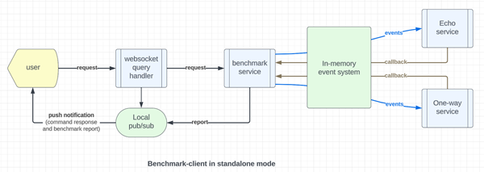

# Purpose

Real-world performance often differs from best case scenarios in a laboratory setting.

This benchmark system offers a scientific way to measure near real-world performance for
the in-memory event system. You may extend the system to do publish/subscribe over a network
event system such as Kafka.

# Benchmark client

This benchmark client is generalized for the following use cases:

## In-memory event system

> Figure 1 - Benchmark system in standalone mode



# How it works?

## Event flow

Since event flow is asynchronous, the user will connect to the benchmark client application using websocket.
A simple websocket client UI application is encoded in the "benchmark.html" page that can be selected from
the home page "index.html".

The user interface has a button to start/stop a websocket connection to the benchmark client application and
an input box to submit your command.

The command will be delivered to the "websocket query handler" in the benchmark client application.
Upon connection, it will register the websocket connection with a "Local Pub/Sub" topic called "benchmark.users"
that will push the benchmark result to the web browser automatically.

The Local Pub/Sub system allows more than one test user to see the real-time benchmark progress and result.

The websocket query handler will forward the user request to the "benchmark service" that will interpret
the command and construct a set of parallel events to the server.

In standalone mode, the client application will also serve as the "server" providing the two event consumers
"network.echo" and "network.one.way".

The "echo" service will return the original payload back to the benchmark service.

The "one-way" service will return a timestamp that indicates when an event is successfully received by
the "event consumer".

The timestamp in the one-way service is important because it allows the benchmark service to calculate
the "one-trip" latency in milliseconds. Since event system is heavily buffered by a commit log, this benchmark
method is more accurate and realistic than just measuring time to publish a set of events.

The echoed event is used by the benchmark service to compute the "round-trip" latency.

# Running this benchmark application

Please "cd" to this subproject and enter "mvn clean install" or "mvn clean verify".

Note that the "install" or "verify" phase of the maven build life cycle ensures that a clean up script
can be executed after the "package" phase. This generates an executable JAR for the subproject.

Before you run the benchmark application, build the application like this first:

```shell
# build Mercury libraries from source if you have not done so
cd sandbox/mercury-composable
# build the client and server apps
mvn clean install
cd benchmark/benchmark-client
mvn clean install
```

The benchmark client is pre-configured to run in standalone mode. You can start it like this:

```shell
cd sandbox/mercury-composable/benchmark-client
java -jar target/benchmark-client-3.1.2.jar
```

Then point your browser to http://127.0.0.1:8083 and select "benchmark" to see the benchmark
control screen.

Click "start service" and then enter "help". It will show the options.

The syntax for running a benchmark test is:

```shell
async | echo | http {count} payload {size}
```

"async" means it will send events from the producer to the consumer in a single direction.
The consumer will save a timestamp so that the latency can be calculated.

"echo" means it will send events from the producer to the consumer where the consumer will echo
back the input to complete a round trip measurement.

Size of the event payload is measured in bytes. The payload does not count the event metadata. 
However, the metadata overheads are minimal and they do not impact the accuracy of the benchmark.

"http" is a special case for "Event Over HTTP". You would need to provide the target server URL
using the "set target {eventOverHttpTarget}" command first.

e.g. http://127.0.0.1:8083 would tell the system to make "event over HTTP" calls to itself through
the network. http://127.0.0.1:8085 would tell the system to make "event over HTTP" calls to another
benchmark server in localhost. If you deploy the benchmark client and server in your environment,
please replace the localhost address with your target server address.

This would evaluate the inter-container communication efficiency between application containers
using HTTP.

# Behind the curtain

The underlying in-memory event system is the Eclipse Vertx in-memory event stream system.

For reactive flow-control, mercury implements a manager/workers pattern for each service.

The number of workers per service is configured to be 200. The benchmark functions run as "coroutines" to
reduce stress on the Java VM. When the number of concurrent requests is more than 200, the system will 
queue the outstanding requests orderly.

The performance benchmark report reflects this queueing mechanism and orderly execution, thus
offering a more realistic performance projection in real-world use cases.

# Payload size and number of events per test

As anticipated, the most efficient payload size over the network is 6 to 10 KB.

However, you can adjust the size of the payload for the event from 10 to 2,000,000 bytes to mimic your
real-world use cases.

You can select the number of parallel events from 1 to 5,000 to simulate your real-world use cases.

Due to efficient reactive design, the system's performance would improve under higher load.

# Deploying to performance test environment

The performance test environment may be on-prem or in the cloud.

If you are using Kubernetes, you should dockerize the benchmark applications using your organization's
approved docker image. You can use Java (JRE or JDK) 21 as the base image. The kernel is likely to be
a bare minimal linux but your environment may use different operating system that you prefer.

# Warming up the benchmark system

Since Java takes a bit more time to load new "objects" into memory, please ignore the first round of test
when the application is first deployed because it is likely to be slower than normal. 

Similarly, you should also ignore the first round of test after a long period of idle.

The in-memory event system and Kafka are designed to handle stress very well. You may see performance
gain with more events. We recommend to start the test with 1,000 events per test. It is normal to see
better performance results when the system is under heavy load and this may not be intuitive.

You can also test smaller number of events to simulate the use case with very light traffic.
