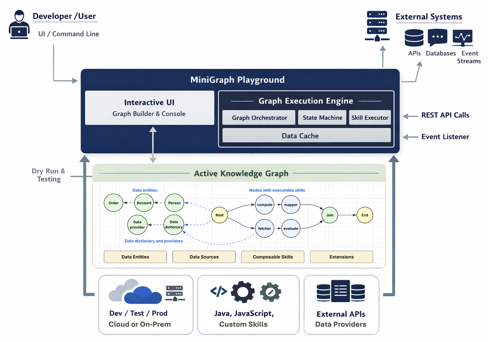

# MiniGraph Playground – Executive Summary

*An implementation of an in-memory property graph for computation and decision-making.*

---

## Overview

MiniGraph Playground is a graph-based application modeling and execution platform that enables rapid development of backend services, APIs, and decision logic — **without writing application code**.

At its core is the concept of an **Active Knowledge Graph**: a graph model that not only represents knowledge and relationships, but also **executes behavior** through embedded skills during graph traversal.

This approach allows organizations to:

- Build decision-centric and data-driven backend services
- Rapidly prototype and evolve business logic
- Decouple application behavior from traditional code deployments

---

## What Is an Active Knowledge Graph?

Traditional property graphs model entities (nodes), relationships (edges), and attributes. MiniGraph extends this by allowing nodes to carry **executable skills**.

An **Active Knowledge Graph**:

- Encodes business knowledge as graph structures
- Assigns executable skills to selected nodes
- Executes logic dynamically as the graph is traversed

When traversal reaches a node with a skill:

1. The graph executor invokes a composable function
2. Inputs are derived from node attributes and the execution context
3. The function returns a result
4. The executor determines the next traversal path

This transforms a static knowledge graph into a **living execution model**.

---

## Semantic Application Design

Active Knowledge Graph introduces a new paradigm called **Semantic Application Development**:

| Layer        | Technology               | Description                                                                               |
|:-------------|:-------------------------|:------------------------------------------------------------------------------------------|
| Semantic     | *Active Knowledge Graph* | Application execution is based on derived knowledge — no imperative code required.    |
| Composable   | *Event Script*           | Event choreography of independent, immutable functions. Roughly 50% config, 50% code. |
| Event-driven | *Platform Core*          | Asynchronous, parallel processing of application logic through events.                |

---

## Why This Matters

### Business Impact

- **Faster time-to-market** — Change logic by updating graph models, not code
- **Lower risk** — Dry-run and inspect execution paths before deployment
- **Better alignment** — Business rules, data, and execution live in one unified model
- **Scalability** — Execution is backed by a composable, event-driven architecture

### Industry Context

MiniGraph aligns with — and advances — key industry trends:

- Graph-based decision engines
- Workflow and orchestration platforms
- Event-driven and composable architectures
- Low-code / no-code backend development

Unlike traditional workflow tools, MiniGraph models both **knowledge and execution** within a single graph.

---

## Built-In Capabilities

MiniGraph Playground ships with built-in skills for common enterprise needs:

- Data mapping and transformation
- Mathematical and logical evaluation
- External API integration
- Cross-graph execution
- Orchestration and branching control

These capabilities allow complex backend behaviors to be composed visually and executed reliably.

---

## Governance and Lifecycle

MiniGraph supports a structured, enterprise-grade development lifecycle:

1. Create graph models interactively
2. Test and validate individual skills
3. Perform full dry-run executions
4. Certify graph behavior
5. Deploy to non-production environments
6. Execute functional and performance tests
7. Promote models through staging
8. Approve and deploy to production

Once deployed, a graph model is invokable as a standard API endpoint or event listener.

---

## Strategic Value

MiniGraph Playground enables organizations to:

- Externalize business logic from application code
- Standardize execution patterns across teams
- Improve observability and explainability
- Build adaptable systems resilient to change

It represents a shift from **application-centric development** to **knowledge- and execution-centric design**.

---

## Technology Review

> *Figure 1 – Architecture Diagram*

MiniGraph Playground is a developer-focused environment for creating, testing, and executing Active Knowledge Graphs. It provides both a **graph execution engine** and a **self-service interactive UI**, enabling developers to model backend logic, decision flows, data access, and orchestration using graph structures and composable skills.

---

## Core Concepts

### Active Knowledge Graph

An Active Knowledge Graph is a directed graph with:

- A **root node** — the execution entry point
- An **end node** — the execution completion marker
- One or more nodes configured with executable skills

Traversal begins at the root and continues until the end node is reached, or until traversal is intentionally paused or redirected.

---

### Node Types

MiniGraph supports three primary node categories:

#### 1. Data Entity Nodes
Represent business entities and their attributes — *what the system knows*.

Examples: Person, Account, Order

#### 2. Data Dictionary & Provider Nodes
Define external data sources and API contracts, including:

- Attribute definitions
- Endpoint configurations
- Request and response mappings

These nodes enable integration with external systems.

#### 3. Skill Nodes (Active Nodes)
Execute actions during traversal, including:

- Computation
- Decision making
- Data fetching
- Flow control

Skill nodes are the **behavioral backbone** of the graph.

---

## Skills and Execution Model

A skill is implemented as a **Composable Function** — self-contained, event-driven, and stateless.

During execution:

1. The graph executor sends input to the skill
2. The skill executes and returns a result
3. The executor updates the graph state machine
4. Traversal continues based on the outcome

---

## Built-In Skills

| Skill                  | Description                                                        |
|:-----------------------|:-------------------------------------------------------------------|
| `graph.data.mapper`    | Maps data between nodes                                            |
| `graph.math`           | High-performance math and boolean evaluation (Java)                |
| `graph.js`             | JavaScript-based expression evaluation (more flexible, but slower) |
| `graph.api.fetcher`    | Invokes external APIs using data dictionary definitions            |
| `graph.extension`      | Executes another graph model                                       |
| `graph.island`         | Pauses traversal to isolated subgraphs                             |
| `graph.join`           | Synchronizes multiple execution paths                              |

Each skill has its own help page with syntax, parameters, and examples.

---

## Interactive Development Experience

MiniGraph Playground provides:

- A command prompt for graph operations
- Console output with execution details
- Visual graph rendering via `describe graph`

The environment is intentionally **playful and exploratory**, designed to encourage incremental modeling and validation.

---

## Testing and Dry-Run Execution

Developers are encouraged to:

- Execute individual skill nodes
- Inspect intermediate state machine data
- Validate traversal paths visually

A **dry-run** starts at the root node, traverses the graph using mock input, displays execution paths and outputs, and requires no live system dependencies.

---

## Deployment Model

After validation, graph models are deployed to cloud environments and exposed via a generalized API endpoint: `/api/graph/{graph-id}`

Execution is decoupled from protocol using **Event Script**, enabling:

- REST invocation
- Event-driven execution (e.g., Kafka)
- Future protocol extensions

---

## Help System

MiniGraph includes comprehensive built-in help covering:

- Node creation, editing, and deletion
- Graph traversal and execution
- Import/export
- Data dictionary configuration
- Skill-specific usage

Help pages are accessible directly from the Playground UI and serve as the primary learning resource.

---

## Extensibility

Graph models can be extended in four ways:

1. **API Fetcher Feature** — Add a small software component to pre- or post-process API requests and responses (e.g., handling OAuth2 bearer tokens).
2. **Graph Extension** — Connect one graph model with one or more others to build larger capabilities.
3. **Flow Extension** — Integrate a graph model with one or more event flows to delegate complex processing to composable software modules.
4. **Custom Graph Skill** — In exceptional cases, create a new reusable graph skill. Note: this is reserved for graph execution engine development and is not recommended for user application development.

---

## Summary

MiniGraph Playground enables developers to model backend logic visually, execute complex flows without orchestration code, test and validate behavior early, and deploy production-ready graph-based services — bridging graph modeling, event-driven execution, and composable design into a single, coherent developer experience.

---

## Glossary

**Active Knowledge Graph** — A property graph extended with executable skills on nodes; logic executes during traversal.

**Active Node / Skill Node** — A node configured with a skill that runs during traversal (compute, decision, fetch, or flow control).

**Composable Function** — A self-contained, stateless, event-driven function that can be invoked independently and reused across graphs.

**Data Cache** — Runtime cache used by the execution engine to store intermediate values and reduce repeated lookups.

**Data Dictionary Node** — A graph node describing data attributes and external contract definitions (schemas/mappings).

**Data Entity Node** — A graph node representing a business entity and its attributes (e.g., Person, Account).

**Data Provider Node** — A graph node defining how external data is accessed (endpoint configuration, request/response mapping).

**Dry-Run** — A non-production execution that traverses the graph using mock input, displaying execution paths and outputs without requiring live dependencies.

**End Node** — Terminal node marking execution completion.

**Event Script** — Event choreography of composable functions; used as a protocol-decoupling layer enabling REST or event-driven invocation of graph execution.

**Execution Context** — Inputs and runtime state passed between skills and used to evaluate branching.

**Graph Execution Engine** — Runtime responsible for orchestrating traversal, invoking skills, managing state, and caching.

**Graph Extension** — A composition pattern where one graph invokes another to build larger capabilities.

**Graph Orchestrator** — The component that coordinates traversal steps and skill invocation sequencing.

**Island** — An isolated subgraph execution pattern that pauses traversal for containment or staged processing.

**Join** — A synchronization mechanism that merges multiple execution paths.

**Property Graph** — A graph model where both nodes and edges can hold properties/attributes.

**Root Node** — The entry point for graph traversal and execution.

**Semantic Application Development** — A paradigm where execution is driven by derived knowledge represented in an Active Knowledge Graph, rather than imperative application code.

**Skill Executor** — The component that invokes skills and handles their results.

**State Machine** — The runtime component that tracks traversal state, transitions, and branching outcomes.

 

|          Chapter-10          |                   Home                    |
|:----------------------------:|:-----------------------------------------:|
| [Mini-Graph](CHAPTER-10.md)  | [Table of Contents](TABLE-OF-CONTENTS.md) | 
