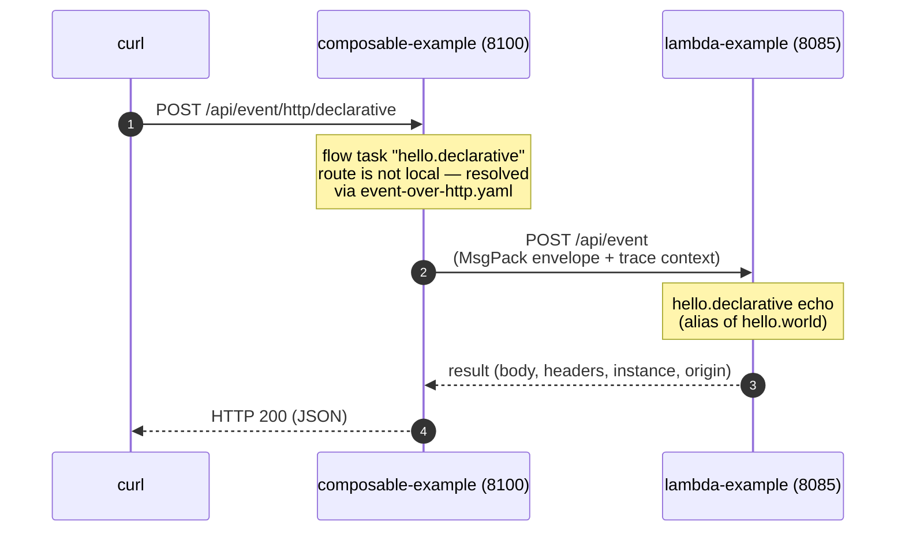

# Event over HTTP

*Guide: How to enable cross-instance event communication via the Event API endpoint.*

> **At a glance**
>
> - **What** — call a function in *another* Mercury instance over HTTP via the built-in Event API
>   endpoint, preserving the EventEnvelope model across the wire.
> - **For** developers distributing functions across instances.

The in-memory event system allows functions to communicate with each other in the same application memory space.

In composable architecture, applications are modular components in a network. Some transactions may require
the services of more than one application. "Event over HTTP" extends the event system beyond a single application.

The Event API service (`event.api.service`) is a built-in function in the system.

## The Event API endpoint

To enable "Event over HTTP", you must first turn on the REST automation engine with the following parameters
in the application.properties file:

```properties
rest.server.port=8085
rest.automation=true
```

The Event API endpoint is one of the **default system endpoints** (alongside the actuator
endpoints): when REST automation starts, the following entry is merged into your "rest.yaml"
automatically if you have not defined `POST /api/event` yourself — no configuration is needed.
Define it explicitly only to customize the entry, for example to change the 60-second default
timeout or to attach an authentication service (shown later in this page).

```yaml
  - service: [ "event.api.service" ]
    methods: [ 'POST' ]
    url: "/api/event"
    timeout: 60s
    tracing: true
```

This exposes the Event API endpoint at port 8085 and URL "/api/event". 

In kubernetes, The Event API endpoint of each application is reachable through internal DNS and there is no need
to create "ingress" for this purpose.

### Wire format and cross-language interoperability

The serialized event envelope rides on the HTTP request body as MsgPack bytes. By default
it uses the language-neutral **standard** format documented in the
[Event Envelope Wire Format](event-envelope-wire-format.md) reference, so an application
built with the official [Rust implementation](https://github.com/Accenture/mercury) (or a
future language port) can call — and be called by — a Java application with no
configuration.

Inbound decoding always accepts both the standard and the classic **compact** format
automatically, and the `/api/event` service replies in whatever format the request
arrived in. When calling an older Java peer that does not yet understand the standard
format, select the compact fallback globally with `event.over.http.format=compact`, or
per call by adding the `x-event-format: compact` header to the optional headers of the
Event-over-HTTP API (also usable in the `headers` section of a `yaml.event.over.http`
target). The header is a client-side instruction — it is consumed by the sender, never
transmitted.

## Test drive Event API

The fastest test drive is the ready-to-run
[demo below](#zero-code-demo): the composable-example ships two REST endpoints that exercise
both Event-over-HTTP patterns against the same peer function in the lambda-example —
**programmatic** (the PostOffice request API with an explicit Event API endpoint URL) and
**declarative** (a foreign route resolved through `event-over-http.yaml`).

The method signatures of the programmatic Event API are shown as follows:

### Asynchronous API (Java)

```java
// io.vertx.core.Future
public Future<EventEnvelope> asyncRequest(final EventEnvelope event, long timeout,
                                          Map<String, String> headers,
                                          String eventEndpoint, boolean rpc);
```

### Sequential non-blocking API (virtual thread function)

```java
// java.util.concurrent.Future
public Future<EventEnvelope> request(final EventEnvelope event, long timeout,
                                          Map<String, String> headers,
                                          String eventEndpoint, boolean rpc);
```

Optionally, you may add security headers in the "headers" argument. e.g. the "Authorization" header.

The eventEndpoint is a fully qualified URL. e.g. `http://peer/api/event`

The "rpc" boolean value is set to true so that the response from the service of the peer application instance 
will be delivered. For drop-n-forget use case, you can set the "rpc" value to false. It will immediately return
an HTTP-202 response.

## Event-over-HTTP using configuration

While you can call the "Event-over-HTTP" APIs programmatically, it would be more convenient to automate it with a
configuration. This service abstraction means that user applications do not need to know where the target services are.

You can enable Event-over-HTTP configuration by adding this parameter in application.properties:

```text
#
# Optional event-over-http target maps
#
yaml.event.over.http=classpath:/event-over-http.yaml
```

and then create the configuration file "event-over-http.yaml" like this:

```yaml
event:
  http:
  - route: 'hello.declarative'
    target: 'http://127.0.0.1:${peer.demo.port}/api/event'
  - route: 'event.save.get'
    target: 'http://127.0.0.1:${server.port}/api/event'
    # optional security headers
    headers:
      authorization: 'demo'
```

In the above example, there are two routes (hello.declarative and event.save.get) with target URLs.
If additional authentication is required for the peer's "/api/event" endpoint, you may add a set of security
headers in each route.

When you send an asynchronous event or make a RPC call to one of these routes, it will be forwarded to the
peer's "event-over-HTTP" endpoint (`/api/event`) accordingly. If the route is a task in an event flow,
the event manager will make the "Event over HTTP" call to the target service.

You may also add environment variable or base configuration references to the target URLs, such as
"peer.demo.port" and "server.port" in this example.

> *Note*: The target function must declare itself as PUBLIC in the preload annotation. Otherwise, you will get
          a HTTP-403 exception.

The demo below is a complete working example of this service abstraction.

## Zero-code demo: composable-example to lambda-example {#zero-code-demo}

The two example applications ship with a working declarative demo. The composable-example
(port 8100) has a REST endpoint wired to an Event Script flow whose only task is the route
`hello.declarative` — a route that does **not** exist in the composable-example. The
`event-over-http.yaml` configuration tells the system where that route lives, and the event
manager makes the Event-over-HTTP call automatically. There is no orchestration or HTTP
client code anywhere: the caller side is a flow definition plus two configuration entries,
and the callee side is an ordinary public function.



The moving parts:

**Callee — lambda-example (port 8085).** The `HelloWorld` echo function is public and
registers two route names; the second is an alias created for this demo:

```java
@PreLoad(route="hello.world, hello.declarative", instances=10, isPrivate = false)
public class HelloWorld implements LambdaFunction {
```

**Caller — composable-example (port 8100).** In `application.properties`, the declarative
routing file is turned on and the peer address is externalized:

```properties
yaml.event.over.http=classpath:/event-over-http.yaml
peer.demo.host=127.0.0.1
peer.demo.port=8085
```

`event-over-http.yaml` maps the foreign route to the peer's Event API endpoint:

```yaml
event.http:
  - route: 'hello.declarative'
    target: 'http://${peer.demo.host:127.0.0.1}:${peer.demo.port}/api/event'
```

and the REST endpoint `GET/POST /api/event/http/declarative` (see `rest.yaml`) runs the flow
`event-over-http-declarative` whose task simply names the route:

```yaml
tasks:
  - name: 'event-over-http-declarative'
    input:
      - 'input.header -> header'
      - 'input.body -> *'
    process: 'hello.declarative'
    output:
      - 'text(application/json) -> output.header.content-type'
      - 'result -> output.body'
    description: 'Make an Event-over-Http call using the event-over-http.yaml configuration'
    execution: end
```

### Step by step

1. Build and start the callee in one terminal (`x.y.z` is the current version in the root `pom.xml`):

    ```shell
    cd examples/lambda-example
    mvn clean package
    java -jar target/lambda-example-x.y.z.jar
    ```

2. Build and start the caller in a second terminal:

    ```shell
    cd examples/composable-example
    mvn clean package
    java -jar target/composable-example-x.y.z.jar
    ```

3. Hit the demo endpoint:

    ```shell
    curl -s -X POST -H "content-type: application/json" \
         -d '{"hello": "world"}' http://127.0.0.1:8100/api/event/http/declarative
    ```

4. The lambda-example's echo function replies through the same path in reverse — the response
   arrives as regular JSON:

    ```json
    {
      "body": { "hello": "world" },
      "headers": {
        "x-flow-id": "event-over-http-declarative",
        "my_trace_id": "51fb9a95cb6b47169dd83771283aebc2",
        "my_trace_path": "POST /api/event/http/declarative",
        "...": "..."
      },
      "instance": 4,
      "origin": "20260722ec4dc39307f94178be2e87a5620fb4ec"
    }
    ```

    The `origin` identifies the application instance that actually executed the function —
    the lambda-example, not the app you called.

5. Look at both applications' logs: the trace context propagated across the HTTP hop
   automatically. Both apps log telemetry under the **same trace id**, the
   `hello.declarative` record carries `span_id` and `parent_span_id` chaining it onto the
   caller's flow, and — with the default-on
   [application log context](observability.md#log-context) — every structured log line on
   both sides is stamped with that trace id.

### The programmatic twin

The composable-example has a second endpoint, `/api/event/http/programmatic`, that reaches
the **same peer function** through the programmatic pattern. Its flow task
(`v1.event.over.http.rpc`, class `EventOverHttpRpc`) builds the peer's Event API endpoint
URL from the same `peer.demo.host` / `peer.demo.port` properties and passes it directly to
the PostOffice request API — so `hello.world` needs **no entry** in `event-over-http.yaml`:

```java
String eventEndpoint = "http://" + host + ":" + port + "/api/event";
EventEnvelope req = new EventEnvelope().setTo("hello.world").setBody(input);
EventEnvelope response = po.request(req, 10000, Collections.emptyMap(), eventEndpoint, true).get();
```

```shell
curl -s -X POST -H "content-type: application/json" \
     -d '{"hello": "world"}' http://127.0.0.1:8100/api/event/http/programmatic
```

The response has the same echo shape, and the trace continues across the hop the same way.
This is why the echo function registers **two route names**: the programmatic endpoint calls
the primary route `hello.world`, the declarative endpoint calls the alias
`hello.declarative` — against a Java callee, the echoed `my_route` header shows which route
(and therefore which pattern) served the call.
Choose declarative when the target address is deployment configuration (the usual case);
choose programmatic when the code must compute or vary the target at runtime.

### Authentication: the event.api.auth demo

The demo pair also shows how to protect the Event API endpoint. The lambda-example
overrides the default `/api/event` entry in its `rest.yaml` to attach an authentication
service:

```yaml
  - service: "event.api.service"
    methods: ['POST']
    url: "/api/event"
    timeout: 60s
    authentication: 'event.api.auth'
    tracing: true
```

The `event.api.auth` function (class `EventApiAuth`) validates the caller's
`authorization` header against a shared secret that **both peers resolve from the
environment** — never hard-code a real credential in source or configuration files:

```properties
# application.properties on both sides - "demo" is the local-development fallback
demo.peer.token=${DEMO_PEER_TOKEN:demo}
```

On the calling side, the declarative route presents the token as a security header in
`event-over-http.yaml`:

```yaml
event.http:
  - route: 'hello.declarative'
    target: 'http://${peer.demo.host:127.0.0.1}:${peer.demo.port}/api/event'
    # security headers (optional. Added for this demo only)
    headers:
      authorization: '${DEMO_PEER_TOKEN:demo}'
```

and the programmatic task passes the same token in the `headers` argument of the request
API. A wrong or missing token gets an HTTP-401 without ever reaching the target function.

When authentication passes, headers returned by the auth service become **session info**
that rides to the target function as read-only headers — the demo's auth service adds
`user: demo`, so you can see it echoed in the response body as proof that the request went
through authentication. Replace the demo class with your own OAuth 2.0 bearer-token
validation for production use.

### Same demo, different language

The official [Rust implementation](https://github.com/Accenture/mercury) ships counterpart
examples: **hello-world** is the parallel of the lambda-example (same port 8085, same public
`hello.world` / `hello.declarative` echo), and **hello-flow** is the parallel of the
composable-example. That makes the demo above a cross-language demo with **zero changes**:

1. Stop the lambda-example.
2. Start the Rust hello-world from a clone of the Rust repository:

    ```shell
    cargo run -p hello-world
    ```

3. Run the same `curl` command again.

The response has the same shape — only the `origin` now identifies the Rust application.
The composable-example neither knows nor cares which language serves the route: it addresses
a route name, the envelope travels in the language-neutral
[standard wire format](event-envelope-wire-format.md), and the trace context continues across
the language boundary.

The mirror direction works the same way: the Rust hello-flow (port 8100) declares
`hello.declarative` in its own `event-over-http.yaml` and can call the Java lambda-example —
or the Rust hello-world — interchangeably. Point `peer.demo.host` / `peer.demo.port` at any
peer that exposes the route.

## Advantages

The Event API exposes all public functions of an application instance to the network using a single REST endpoint.

The advantages of Event API includes:

1. Convenient - you do not need to write or configure individual endpoint for each public service
2. Efficient - events are transported in binary format from one application to another
3. Secure - you can protect the Event API endpoint with an authentication service

The following configuration adds authentication service to the Event API endpoint:
```yaml
  - service: [ "event.api.service" ]
    methods: [ 'POST' ]
    url: "/api/event"
    timeout: 60s
    authentication: "v1.api.auth"
    tracing: true
```

This enforces every incoming request to the Event API endpoint to be authenticated by the "v1.api.auth" service
before passing to the Event API service. You can plug in your own authentication service such as OAuth 2.0 
"bearer token" validation. A complete working example is the
[event.api.auth demo](#authentication-the-eventapiauth-demo) above.

Please refer to [REST Automation](rest-automation/index.md) for details.
## See also

- [Interop Test Report (Java ⇄ Rust)](../test-reports/event-over-http-interop.md) — the live
  bidirectional validation of both patterns, with span-level trace evidence.
- [Spring Boot Integration](spring-boot.md) — run Mercury in Spring Boot.
- [Minimalist Service Mesh](service-mesh.md) — Kafka-based service discovery & routing.
- [REST Automation](rest-automation/index.md) — declarative HTTP endpoints, no controllers.
