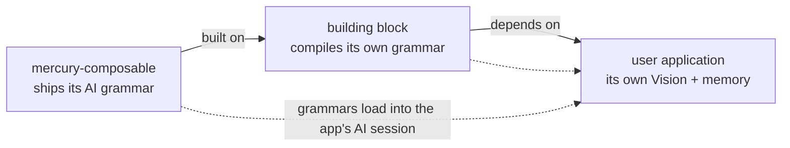
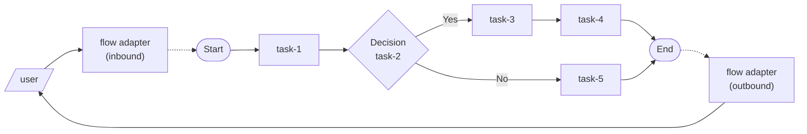
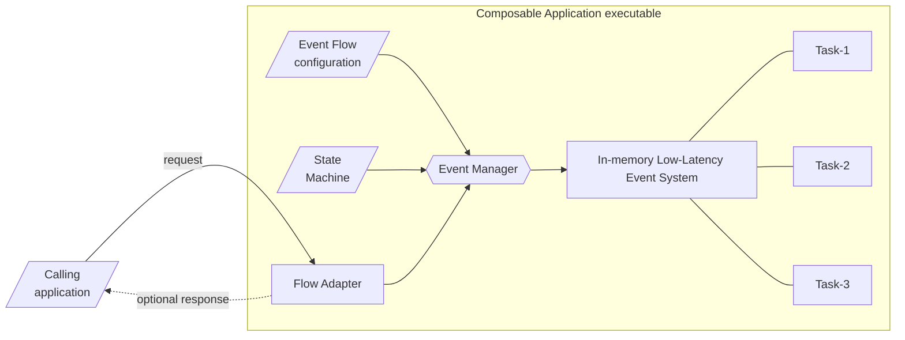

# Methodology

*Concepts: how Mercury Composable is meant to be practiced — Intent-Driven Development as the
main theme, realized down the layers: knowledge graph, composable design, event-driven core.*

> **At a glance**
>
> - **What** — the Intent-Driven Development methodology (humans own intent; AI partners
>   co-author governed artifacts), the knowledge-graph path it recommends, and the composable
>   design principles beneath both.
> - **For** product owners, architects, and developers building with AI partners; the
>   [Architecture Overview](architecture.md) is the technical companion.

## Intent-Driven Development

**Intent-Driven Development (IDD)** is the collaboration model this framework is built for.
Humans own the *intent* — purpose, constraints, priorities, and judgment. AI partners help
refine that intent and translate it into designs, models, flows, tests, and implementation
artifacts. Three mechanisms keep the collaboration faithful: **shared memory** preserves
continuity across sessions, **AI grammar** makes each DSL legible to a machine so an agent
authors from rules rather than inferring from examples, and **validation gates** keep every
generated artifact aligned with the intent behind it. The full argument is the white paper,
[Intent-Driven Development and the Architecture of Human-AI Collaboration](https://accenture.github.io/mercury-composable/mercury-story/).

### How a developer builds with an AI partner

**Step 1 — AI-enable the project.** Greenfield or existing, the first move is the same:
install the [shared memory layer](https://accenture.github.io/mercury-go/), write the
**Vision** with the AI partner — human-confirmed, never fabricated — derive the **Blueprint**
of gaps, and plan increments. Every session thereafter starts oriented: the AI reads where the
project is, where it is going, and why, before it touches anything.

**Step 2 — Add the engine and choose the path.** The engine arrives carrying its own AI
grammar, so an AI partner can author correct artifacts from the first session.
**Recommended for applications: Layer 3** — model the service as a knowledge graph, dry-run it
in the Playground, deploy it behind the CompileGraph gate. The path is a dial, not a wall:
drop down to Event Script, or to a platform-core function, exactly where the problem demands
it — and no further.

**Step 3 — Build the app, or a building block.** An application travels
**intent → model → certify → deploy**. A building block combines layer-2 and layer-3
patterns — and then **compiles an AI grammar into its own repository**, so the block becomes
as legible to the next AI partner as Mercury itself.

> Proof point for step 1: Mercury's own Rust engine was AI-enabled *before its first line of
> code* — about a hundred increments later, it ships in lock-step with the Java engine.

### Grammar composes the way dependencies compose



The session that builds the application loads Mercury's grammar **plus** each building
block's grammar — a near-constant token cost per block, instead of an ever-growing pile of
source to re-read. The recursion is already live inside the framework: twin-kafka is a
building block on a building block — and while its discovery-map entry was missing, AI
partners fell back to reading source.

> To an AI partner, undocumented capability is absent capability.

## Knowledge graph — model as the application

The recommended altitude for applications is the top of the ladder: capture business intent,
enterprise knowledge, and system behavior as one executable **Active Knowledge Graph**, so
the model *is* the application. The working loop is the IDD loop made concrete —
**intent → model → certify → deploy**: draft the graph with an AI companion, dry-run it in
the Playground, let the product owner read and certify it, then deploy it behind the
CompileGraph quality gate. Changing what the system does becomes **refining the model** —
recertify, redeploy — not rewriting code.

[Knowledge Graph as Application](knowledge-graph/index.md) is the layer's own guide.
Zero-code is the default there, never a dogma: Event Script and custom functions remain
first-class escape hatches — which is exactly why the composable principles below matter.

## Composable design

Software development is a long fight against complexity — and most of that complexity is *coupling*: code
that cannot change without breaking something else. Composable methodology attacks coupling at its source.
You build an application from **self-contained functions** that know nothing about one another, then wire
them together with configuration instead of code. Functions become plug-and-play: you mix and match them
into new applications, run multiple versions side by side, and retire one without side effects on the rest —
so applications are easier to design, build, maintain, deploy, and scale.

Composable architecture became an industry direction around 2022, alongside Domain-Driven Design (DDD),
CQRS, and microservices. Mercury was among the first frameworks to realize it end-to-end for event-driven
systems — the sections below are how that realization works in practice.

### Aligning product and engineering

The composable methodology takes a different approach in software development that empowers and aligns product owners,
business analysts, technology architects and software engineers.

Historically, there is a disconnect between product features and application design because product is user and
business focused but application design is technology oriented. Product owners have almost no direct control over
the quality of the user applications that are supposed to address business requirements. There is a communication
barrier between the two domains in most projects. It requires a lot of iterations to get things right. The lack of
direct connection between business domain and technical domain also leads to higher technical debts that are not just
limited to imperfect coding.

Composable methodology addresses this fundamental issue by connecting the two domains seamlessly.

Before developers write a line of code, we start a project from product design. The output from a product design
is a business transaction event flow diagram, ideally from a tactical Event Storming workshop or a more relaxed
white boarding discussion among product owners, business domain experts and technology architects.

> Figure 1 - Event Flow Diagram



As shown in Figure 1, a transaction flow diagram has a start point and an end point. Each processing step is called
a "task". Some tasks would do calculation and some tasks would make decision to pass to the next steps.

> *Note*: Task types include decision, response, end, sequential, parallel, fork, sink and pipeline.

The product team designs a transaction flow to address a business use case and presents it as a diagram.
Naturally, this is how a human designer thinks. We don't want to prematurely adjust the business requirements
to any infrastructural limitation.

### Events at the center of the modern enterprise

In Domain Driven Design, it is well accepted that business transactions and their intermediate objects can be
represented as "events".

An event is a holder of a business object that may be a transaction request, a transaction response, a data object
or any intermediate data representation. Generally, a data object is a structure of key-values.

For simplicity, we will call a transaction flow diagram as "Event Flow Diagram" from now on.

### First principle - "input-process-output"

The first principle of composable application design is that each function (called a **task** when it is a step
in an event flow) is self-contained and its input and output are immutable.

Self-containment means that the task or function does not need to know the world outside its functional scope, thus
making the function as pure as "input-process-output". i.e. given some input, the task or function will carry out
some business logic to generate some output according to functional specification.

Immutability is an important guardrail for clean code design. A function cannot change the business object outside
its functional scope, thus eliminating the chance of unintended side effects of data interference.

> *Note*: A **task** is a function in its role as a step in an event flow — the same atom, named by where it
          appears. The unit you write is always a **function**; "task" is just what we call it inside a flow diagram.

### Second principle - zero to one dependency

The second principle is that each function should have zero dependency with other user functions.

To connect to the world outside its functional scope, a function may have one and only one dependency with a platform
or infrastructure component function. In composable design, a library can be packaged as a reusable composable
function.

A function consumes a platform component or library by sending an event to the component instead of tight coupling
with a direct method call. Decoupling between functions and components promotes non-blocking, asynchronous and
parallel operation that yields higher performance and throughput.

### Third principle - platform abstraction

Since composable functions are self-contained and independent, they can be reused and repackaged into different
applications to serve different purposes. Therefore, composable functions are, by definition, plug-n-play.

The platform and infrastructure are encapsulated as `adapters`, `gateways` and `wrappers`.
Figure 1 illustrates this architectural principle by connecting an event flow to the user through an event flow
adapter. For example, a "HTTP Flow Adapter" serves both inbound request and outbound response. A "Kafka Flow Adapter"
uses one topic for inbound and another topic for outbound events.

### Fourth principle - event choreography

Without direct coupling, a composable development framework must support "Event Choreography" so that we can
connect the various user composable functions, platform components and libraries together and route the events
according to an event flow diagram for each use case.

### What composable design buys you

Following these principles pays off in concrete ways:

- **Maintainability** — isolated functions are easy to understand, test, and change.
- **Reusability** — a self-contained function can be reused across applications.
- **Performance** — loose coupling enables asynchronous, parallel execution without bottlenecks.
- **Testability** — well-defined input and output make unit testing straightforward.
- **Debuggability** — independent functions make it easy to pinpoint a fault.
- **Technology freedom** — inside a function you may use any style or library; nothing leaks across the boundary.

### Application development

Once we have drawn the event flow diagrams for different use cases, we can create user stories for each composable
function and assign the development of each function to a developer or a pair of developers if using pair-programming.

Composable methodology embraces "Test Driven Development (TDD)". Since each function is self-contained, it is TDD
friendly because the developer does not need to deal with external dependencies for unit tests. It is the first
principle of "input-process-output".

This methodology allows us to scale our application development resources much better than traditional approach
because developers do not need to know details of dependencies, thus avoiding hard code and reducing technical debts.

For integration tests, it is easy to mock platform, infrastructure, database and HTTP resources by assigning
mock functions to some tasks in an event flow. This greatly simplifies integration mocking.

### Seamless transition from product to application design

Event flow diagram describes the product and each composable function contains the specific processing logic.
Data attributes in an event flowing from one function to another provide the clarity for product designers and
application engineers to communicate effectively.

### Application packaging and deployment

Composable functions are independent and isolated. We can package related functions for an event flow in a single
executable. A senior developer or architect can decide how to package related functions to reduce memory footprint
and to scale efficiently and horizontally.

### Smaller memory footprint

By design, composable functions are granular in nature. They are registered to an "event loop" on-demand. i.e.
a function is executed when an event arrives. Without multiple levels of tight coupling, each piece of user code
consumes memory efficiently. Memory is released to the system as soon as the function finishes execution.

## Event-driven core

### Composable framework

To realize the composable design principles, a low-latency in-memory event system is available at the core
of the Mercury-Composable framework.

> Figure 2 - Composable Framework



As illustrated in Figure 2, event choreography for an event flow is described as an "Event Flow Configuration".
An "Event Manager" is implemented as part of a low-latency in-memory event system. Composable functions
(a **task** when wired into an event flow) ride on the in-memory event system so that the event manager can invoke them by
sending events.

Since composable functions are self-contained, the event manager performs input/output data mapping to and from
the functional scope of a composable function. This flexible data mapping allows developers to write more generic
code that responds to different input dataset, thus promoting software reusability.

An in-memory state machine will be created for each execution of a transaction or "event flow". It is used for holding
transaction "states" and temporary data objects.

Sometimes a transaction may be suspended and restarted with different event flows. The in-memory state machine can
be extended to an external datastore so that transaction states can be monitored and recovered operationally.

> *Note*: The framework combines native Java 21 virtual thread management with the Eclipse Vert.x event bus.

### Event Envelope

We use a standard "Event Envelope" to transport an event over the in-memory event bus. An event envelope contains
three parts: (1) body, (2) headers and (3) metadata.

Event body is used to transport a business object. It may be a PoJo or a HashMap.

Headers can be used to carry additional parameters to tell the user composable function what to do.

Examples for metadata include performance metrics, status, exception, optional tracing information, and
correlation ID.

### Language neutral

The event flow configuration syntax and event envelope serialization scheme are standardized for polyglot deployment.
The event flow configuration rides on YAML and event envelope serialization uses binary JSON ("MsgPack").

For higher serialization efficiency, the intermediate format is using "key-value" maps. JSON string is only used at
the inbound and outbound flow adapters.

### Functional isolation

Each function must implement the Composable interface, called "TypedLambdaFunction".

The composable interface enforces a single "handleEvent" method where the function can access the event's headers
and body.

By design, each composable function is invoked by events. It is running parallel with other user functions.
This non-blocking asynchronous execution architecture delivers higher performance than traditional coding approach
with direct method invocation.

While each function is executed in an event-driven and reactive manner, the user application code inside each
composable function may use any coding style including object-oriented design, functional or reactive.

Functional isolation means that you can use any open source or commercial library or framework in your user
function without concerns about thread safety or unintended side effect.

A composable function may look like this:

```java
@PreLoad(route = "my.first.function", instances = 10)
public class MyFirstFunction implements TypedLambdaFunction<MyPoJo, AnotherPoJo> {

    @Override
    public AnotherPojo handleEvent(Map<String, String> headers, MyPoJo input, int instance) {
        // your business logic here
        return result;
    }
}
```

A composable function is declared with a "route name" using the "PreLoad" annotation.

> *Note*: the "instance" count for each composable function controls execution concurrency in a single application.
          It can be used with horizontal scaling to optimize use of computing resources.
For a technical deep dive into how the framework implements these principles,
see the [Architecture Overview](architecture.md).
## See also

- [Architecture Overview](architecture.md) — the technical mental model behind these principles.
- [Getting Started](getting-started.md) — the principles applied in a working app.
- [Event-driven Foundation](event-driven/index.md) — the Layer-1 core these principles run on.
