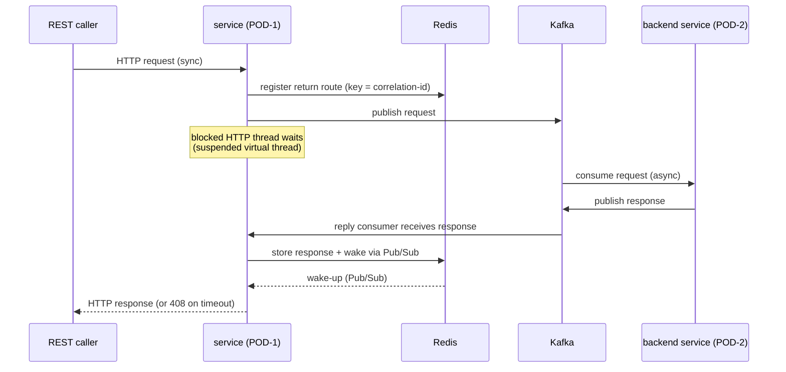

# Sync-over-Async

*Guide: turn an asynchronous Kafka backend into a synchronous REST request/response across pods, with a
Redis return route.*

> **At a glance**
>
> - **What** — a caller makes a normal synchronous REST call; behind it the request travels over Kafka to an
>   asynchronous backend (possibly on another pod) and the response is routed back through **Redis** to the
>   exact pod holding the open HTTP connection.
> - **How** — a **correlation-id** is the return-path key. The originating pod registers a return route in
>   Redis and blocks; the responder stores the response in Redis and wakes the originator via Pub/Sub.
> - **Advanced & opt-in** — a distributed pattern for specific use cases; off by default (it eagerly connects
>   to Redis). Cf. the [service mesh](service-mesh.md) — this is a deliberately lighter, Redis-based return path.
> - **For** developers exposing a cloud-native synchronous facade over an event-driven backend.

In a cloud-native deployment the REST caller and the backend that answers may be different pods, and the
backend is reached **asynchronously** over Kafka. Sync-over-async bridges that gap: the HTTP thread waits
while the request fans out over Kafka and the answer is routed back — without coupling the two pods beyond a
shared Redis and topic pair. It builds on the [Minimalist Kafka](minimalist-kafka.md) for the Kafka legs.

> **Opt-in.** The return-route coordinator eagerly connects to Redis, so it starts only when
> `sync.over.async.enabled=true`. Leave it off unless you are using the pattern.

## The pattern {#pattern}



The correlation-id threads the whole round trip. Redis holds two short-lived keys per request: the **route**
(which pod's channel to wake) and the **response** payload.

## Enabling and configuring {#config}

```properties
sync.over.async.enabled=true
redis.host=${REDIS_HOST:127.0.0.1}
redis.port=${REDIS_PORT:6379}
redis.password=${REDIS_PASSWORD:}     # blank = no auth; keep secrets in the environment
```

On startup the extension builds a Redis client and the return-route coordinator, keyed by this pod's origin
id, from discrete `redis.*` connection parameters and `sync.*` engine tunables. See the
[Configuration Reference](configuration-reference.md#sync-over-async) for the full list; the essentials:

| Key | Default | Description |
|-----|---------|-------------|
| `sync.over.async.enabled` | `false` | Master switch; `true` starts the return-route coordinator. |
| `redis.host` / `redis.port` | `127.0.0.1` / `6379` | Redis connection. |
| `redis.password` | — (blank) | Auth password; source from the environment. |
| `redis.ssl` | `false` | Use TLS (`rediss://`). |
| `redis.database` | `0` | Logical database index. |
| `redis.timeout.ms` | `5000` | Default command timeout. |
| `sync.return.channel.prefix` | `svc-return` | Prefix for the per-pod Pub/Sub return channel. |
| `sync.route.ttl.seconds` | `90` | TTL for the return-route key (cover the REST timeout + buffer). |
| `sync.response.ttl.seconds` | `30` | TTL for the response key (short rendezvous window). |
| `sync.max.pending.requests` | `10000` | Per-pod ceiling on in-flight synchronous requests (backpressure). |

## Reliability cornerstones {#reliability}

The design is correct independent of Pub/Sub timing:

- **Redis is the source of truth.** The responder writes the response to Redis (`SETEX`) **before** sending
  the Pub/Sub wake-up, so a signal can never arrive before the data.
- **Final read before timeout.** If the wake-up is missed, the waiting pod does one last Redis read before
  giving up — so a dropped notification still resolves the request rather than failing it.
- **Exactly-once completion.** The pending-request registry completes each waiting future once, whichever of
  the wake-up path and the timeout path wins; duplicates and orphans are no-ops.
- **Bounded growth.** `sync.max.pending.requests` caps in-flight requests to protect a pod under load.
- **Timeout → 408.** A request with no answer in its budget returns HTTP 408, and its Redis keys are cleaned
  up (TTLs are the safety net for crashes).

## When to use it {#when}

Reach for sync-over-async when you need a **synchronous REST facade over an asynchronous, cross-pod backend**
and want a lightweight Redis return path rather than the full Kafka [service mesh](service-mesh.md) with
presence discovery. Like the mesh, it is an advanced opt-in: if your application does not need cross-pod
synchronous request/response, design it cloud-native and skip this. The Kafka legs use the
[Minimalist Kafka](minimalist-kafka.md); the synchronous facade itself is an ordinary composable function
behind `rest.yaml`.

## See also

- [Minimalist Kafka](minimalist-kafka.md) — the inbound/outbound Kafka building blocks this pattern uses.
- [Configuration Reference](configuration-reference.md#sync-over-async) — every `redis.*` / `sync.*` key.
- [Minimalist Service Mesh](service-mesh.md) — the heavier `cloud.connector=kafka` alternative with service discovery.
- [Observability](observability.md) — tracing the round trip end-to-end.
