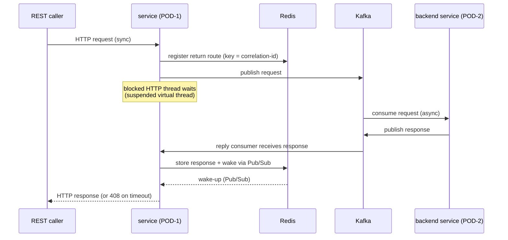

# Sync-over-Async

*Guide: turn an asynchronous Kafka backend into a synchronous REST request/response across pods, with a
Redis return route.*

> **At a glance**
>
> - **What** — a caller makes a normal synchronous REST call; behind it the request travels over Kafka to an
>   asynchronous backend (possibly on another pod) and the response is routed back through **Redis** to the
>   exact pod holding the open HTTP connection.
> - **How** — a **correlation-id** is the return-path key. The originating pod registers a return route in
>   Redis and blocks; the responder stores the response in Redis and wakes the originator via Pub/Sub.
> - **Advanced & opt-in** — a distributed pattern for specific use cases; off by default (it eagerly connects
>   to Redis). Cf. the [service mesh](service-mesh.md) — this is a deliberately lighter, Redis-based return path.
> - **For** developers exposing a cloud-native synchronous facade over an event-driven backend.

In a cloud-native deployment the REST caller and the backend that answers may be different pods, and the
backend is reached **asynchronously** over Kafka. Sync-over-async bridges that gap: the HTTP thread waits
while the request fans out over Kafka and the answer is routed back — without coupling the two pods beyond a
shared Redis and topic pair. It builds on the [Minimalist Kafka](minimalist-kafka.md) for the Kafka legs —
by composition, not by dependency: the extension carries no Kafka library of its own, so the application
declares `minimalist-kafka` alongside `sync-over-async`.

> **Opt-in.** The return-route coordinator eagerly connects to Redis, so it starts only when
> `sync.over.async.enabled=true`. Leave it off unless you are using the pattern.

## The pattern {#pattern}


```mermaid
sequenceDiagram
    participant Caller as REST caller
    participant Pod1 as service (POD-1)
    participant Redis
    participant Kafka
    participant Pod2 as backend service (POD-2)

    Caller->>Pod1: HTTP request (sync)
    Pod1->>Redis: register return route (key = correlation-id)
    Pod1->>Kafka: publish request
    note over Pod1: blocked HTTP thread waits<br>(suspended virtual thread)
    Kafka->>Pod2: consume request (async)
    Pod2->>Kafka: publish response
    Kafka->>Pod1: reply consumer receives response
    Pod1->>Redis: store response + wake via Pub/Sub
    Redis-->>Pod1: wake-up (Pub/Sub)
    Pod1-->>Caller: HTTP response (or 408 on timeout)
```

The correlation-id threads the whole round trip. Redis holds two short-lived keys per request: the **route**
(which pod's channel to wake) and the **rendezvous queue** — a Redis List the responder appends to and the
originating pod drains destructively. A one-shot response is simply a queue whose first entry is terminal;
the same queue carries a whole sequence of progressive segments for the
[streaming return route](#streaming) below.

## Enabling and configuring {#config}

The extension is **transport-neutral**: it brings only platform-core and the Lettuce Redis client, so the
application declares its Kafka library (`minimalist-kafka`) alongside `sync-over-async` in the build. The
facade tasks exchange the correlation-id through the module's own flow-level `cid` key (the
`model.cid -> header.cid` flow mappings) — deliberately independent of the transport's configurable wire
header (`kafka.correlation.id.header`), which the flow adapter maps into `model.cid` whatever its name.
Then enable the coordinator and point it at Redis:

```properties
sync.over.async.enabled=true
soa.redis.host=${REDIS_HOST:127.0.0.1}
soa.redis.port=${REDIS_PORT:6379}
soa.redis.username=${REDIS_USERNAME:}     # blank = default user; set for an ACL/RBAC user
soa.redis.password=${REDIS_PASSWORD:}     # blank = no auth; keep secrets in the environment
soa.redis.cluster.detect=auto             # auto = detect at start-up; else use the boolean below
soa.redis.cluster.mode=false              # true = cluster, false = standalone (when detect is not auto)
```

> **`soa.redis.*` namespace, with a `redis.*` fallback.** The Redis keys carry the `soa.` prefix so
> sync-over-async owns its own Redis configuration and never collides with another `redis.*` consumer in
> the same application — the [distributed cache](distributed-cache.md), or the `minigraph-state-redis`
> extension — which may point at a different server, auth, or topology. **No migration is required:**
> each key falls back to the un-prefixed `redis.*` form when the `soa.` one is absent, so an existing
> `redis.*` deployment keeps working untouched.
>
> **That fallback is backward compatibility, not a recommendation to share.** Sync-over-async predates
> the cache and was configured under plain `redis.*`; the fallback keeps those deployments — and any
> application running sync-over-async **alone** — working as they are. When an application runs
> sync-over-async *and* the cache, give each its own Redis client: set the whole `soa.redis.*`
> connection set here and leave `redis.*` to the cache. See
> [Separate Redis clients, by design](distributed-cache.md#separation) for the reasoning — the decisive
> one being that a cache with an eviction policy can evict a `request:{cid}` rendezvous key mid-request.
> Override a namespace **completely**: because the fallback is per key, setting `soa.redis.host` without
> `soa.redis.password` points this module at the new host carrying the other one's credentials.

On startup the extension builds a Redis client and the return-route coordinator, keyed by this pod's origin
id, from discrete `soa.redis.*` connection parameters and `sync.*` engine tunables. See the
[Configuration Reference](configuration-reference.md#sync-over-async) for the full list; the essentials:

| Key | Default | Description |
|-----|---------|-------------|
| `sync.over.async.enabled` | `false` | Master switch; `true` starts the return-route coordinator. |
| `soa.redis.host` / `soa.redis.port` | `127.0.0.1` / `6379` | Redis connection (or the cluster configuration endpoint). |
| `soa.redis.username` | — (blank) | ACL/RBAC username; blank = the default user. Source from the environment. |
| `soa.redis.password` | — (blank) | Auth password; source from the environment. |
| `soa.redis.ssl` | `false` | Use TLS (`rediss://`). |
| `soa.redis.database` | `0` | Logical database index (standalone only; a cluster is database 0). |
| `soa.redis.cluster.detect` | `auto` | `auto` = probe the seed at start-up; anything else defers to `soa.redis.cluster.mode`. See [Standalone or cluster](#cluster). |
| `soa.redis.cluster.mode` | `false` | Boolean `true` (cluster) / `false` (standalone) when `detect` is not `auto`, and the fallback when an `auto` probe is inconclusive. |
| `soa.redis.cluster.nodes` | — (blank) | Cluster seeds `host:port,host:port`; blank = the single `soa.redis.host:soa.redis.port`. |
| `soa.redis.timeout.ms` | `5000` | Default command timeout. |
| `soa.redis.health.timeout` | `5s` | Timeout for the [`soa.redis.health`](#health) probe. |
| `soa.redis.health.startup.grace` | `30s` | Start-up grace for [`soa.redis.health`](#health) (placeholder healthy status while the client warms up). |
| `sync.return.channel.prefix` | `svc-return` | Prefix for the per-pod Pub/Sub return channel. |
| `sync.route.ttl.seconds` | `90` | TTL for a one-shot return-route key (cover the REST timeout + buffer). |
| `sync.response.ttl.seconds` | `30` | TTL for a one-shot rendezvous queue (short rendezvous window). |
| `sync.max.pending.requests` | `10000` | Per-pod ceiling on in-flight synchronous requests (backpressure). |
| `sync.stream.ttl.seconds` | `1800` | TTL for a [streaming](#streaming) rendezvous's route and queue, refreshed on every post (session-scale — an SSE notification channel legitimately idles). |
| `sync.max.pending.streams` | `1000` | Per-pod ceiling on concurrently open streams. |

### Standalone or cluster Redis {#cluster}

The return route runs against a **single-node** Redis or a **Redis Cluster** (e.g. AWS ElastiCache
cluster-mode-enabled) with no code change. Two keys select the client:

- **`soa.redis.cluster.detect`** — `auto` (the default) probes the seed at start-up (`INFO` →
  `cluster_enabled:1` = cluster, otherwise standalone); one extra probe connection, nothing else changes.
  Any other value (e.g. `off`) skips the probe and defers to the boolean below.
- **`soa.redis.cluster.mode`** — the boolean `true` (cluster) / `false` (standalone), used when
  `detect` is not `auto`, **and** as the fallback when an `auto` probe cannot decide (for example `INFO` is
  restricted on a managed Redis). The boolean form matches a common cache-config convention, so it can be
  shared with a co-resident `redis.cluster.mode` through the fallback.
- **`soa.redis.cluster.nodes`** — cluster seeds `host:port,host:port`; blank uses the single
  `soa.redis.host:soa.redis.port`. A single seed is enough: Lettuce discovers the shard topology from it, so
  pointing `soa.redis.host` at an ElastiCache **configuration endpoint** works.

So the default (nothing set) auto-detects; `soa.redis.cluster.detect=off` with `soa.redis.cluster.mode=true`
forces a cluster client by config; and `detect=auto` with `mode=true` auto-detects but assumes cluster if the
probe is blocked.

The return route is cluster-safe by construction: every key operation is single-key, and the one two-key
delete is split so no command ever spans two hash slots. Classic Pub/Sub wake-ups still reach the waiting
pod across the cluster bus.

**Authentication is identical for both topologies.** AWS applies one AUTH token or RBAC user to the whole
replication group, and the cluster client presents it on every node connection exactly as the standalone
client does — so `soa.redis.username` (for an RBAC user) and `soa.redis.password` are all you set either way, and
`soa.redis.ssl=true` (TLS, required for AUTH on ElastiCache) carries over unchanged. Keep the secrets out of the
file: a credential bootstrap running in a **lower-`sequence` `@MainApplication`** (so it runs before
sync-over-async starts) publishes them as environment variables that the `${REDIS_PASSWORD}` /
`${REDIS_USERNAME}` placeholders resolve. IAM-token authentication — where the password is a short-lived
signed token — is a different mechanism (the same for standalone and cluster) and is not covered by these
static keys.

## Reliability cornerstones {#reliability}

The design is correct independent of Pub/Sub timing:

- **Redis is the source of truth.** The responder appends to the rendezvous queue (`RPUSH`, with an
  atomically refreshed TTL) **before** sending the Pub/Sub wake-up, so a signal can never arrive before
  the data.
- **Final drain before timeout.** If the wake-up is missed, the waiting pod does one last drain of the
  queue before giving up — so a dropped notification still resolves the request rather than failing it.
  (The streaming path applies the same recovery at edge idle expiry.)
- **Exactly-once delivery, structurally.** The queue is drained by destructive pops, so a duplicate or
  spurious wake-up pops nothing; each waiting future completes once, whichever of the wake-up path and
  the timeout path wins, and orphans are no-ops.
- **Bounded growth.** `sync.max.pending.requests` and `sync.max.pending.streams` cap in-flight rendezvous
  to protect a pod under load.
- **Timeout → 408.** A request with no answer in its budget returns HTTP 408, and its Redis keys are cleaned
  up (TTLs are the safety net for crashes).

## Streaming return route {#streaming}

The same rendezvous generalizes from one response to **a sequence of segments with a terminal signal**,
bridging progressive rendering across pods: whichever pod holds the user's HTTP connection opens the
stream (`beginStream(cid, sink)`), and any backend pod posts progressive events straight to Redis with
the lightweight producer API — no coordinator, no subscriber, no enable switch on the producer side:

```java
try (var responder = new StreamResponder(RedisConfig.from(config))) {
    responder.post(cid, StreamSegment.DATA, null, "Hello");
    responder.post(cid, StreamSegment.DATA, "tokens", "{...}");
    boolean live = responder.post(cid, StreamSegment.EOF, null, metadata);
    // false = the rendezvous is over (orphan) - stop producing for that cid
}
```

The producer's whole contract is *post in the order you mean* — there is **no sequence number** to stamp
and no per-cid state to hold. A single producer that requires strict ordering (e.g. an AI-chat token
stream) posts sequentially over one connection: Redis executes each connection's commands in arrival
order and the consuming pod drains serialized per cid, so delivery order equals posting order end-to-end.
Several producers on one cid (e.g. backend services notifying one SSE session) interleave at segment
granularity, by design — and **any** of them may close the channel by posting the terminal `eof` (or
`exception`) entry: "the end signal is also an event". Cleanup is eager on completion and TTL-driven
otherwise; a `false` from `post` always means stop — the consumer disconnected, timed out, or another
producer already closed the channel.

On the consuming side, the facade is an `@EventInterceptor` addressed directly by a `stream: true`
endpoint — the same shape as every shipped streaming producer (see the
[HTTP Response Streaming guide](http-streaming.md)) — and `StreamBridge` is its generic half: it opens
the rendezvous, forwards each drained segment into the request's reply lane (`data` → SSE event,
`eof` → the terminal `done` event, `exception` → the in-band `error` event), and owns the lifecycle:

```java
@PreLoad(route = "my.chat.facade", instances = 50)
@EventInterceptor
public class ChatFacade implements TypedLambdaFunction<EventEnvelope, Void> {
    @Override
    public Void handleEvent(Map<String, String> headers, EventEnvelope request, int instance) {
        String cid = request.getCorrelationId();
        StreamBridge.open(SyncRuntime.coordinator(), request, cid, 30);
        // ... start the backend work however the application likes (the request leg) ...
        return null;
    }
}
```

The `idleSeconds` argument is the idle allowance, applied to the HTTP edge and the bridge's watchdog
alike (widen it for a deliberately quiet notification channel — a notification facade typically reads it
from a request header and announces the session's cid to the UI as its first SSE event). At idle expiry
the watchdog performs **one final drain** — the streaming analogue of the one-shot final read, so a
dropped *final* notification still completes the render — and only if that drain does not complete the
stream does it fail in-band (408) and close the rendezvous, which is also what reclaims a disconnected
client's stream. At stream capacity (`sync.max.pending.streams`) the exchange fails with a proper
HTTP 503 before the head is committed.

The design rationale, decision record and failure analysis live in the
[streaming-return-route design spec](https://github.com/Accenture/mercury-composable/blob/main/draft-design-specs/streaming-return-route.md);
the live two-pod validation — ordered cross-pod rendering plus the chaos checks (lost notifications, a
producer killed mid-stream, a killed UI pod) — is recorded in the
[cross-pod test report](../test-reports/streaming-return-route-cross-pod.md), reproducible via the
[sync-over-async-demo](https://github.com/Accenture/mercury-composable/tree/main/examples/sync-over-async-demo)
`stream-ui` / `stream-producer` profiles.

## Health check {#health}

The module ships a ready-made health-check function at route **`soa.redis.health`** (auto-registered when
the jar is on the classpath) - every critical infrastructure dependency deserves one. Opt in by listing
it as a health dependency in `application.properties`:

```properties
mandatory.health.dependencies=soa.redis.health
# or, when Redis should be reported but not fail /health:
# optional.health.dependencies=soa.redis.health
```

> The route carries the `soa.` prefix deliberately: the plain `redis.health` name is the health check of
> the [distributed cache](distributed-cache.md) module, so both features can coexist against the same
> Redis server.

The probe is a single Redis **PING** on a dedicated connection built from the `soa.redis.*` parameters -
the lightest round trip the protocol offers, and one successful call proves connectivity, TLS, and
authentication in a single request. A reachable server reports a status map; an unreachable one fails
the check with a **503** status and a key-value message (`text` for the DevOps reader, `status` for the
code), so `/health` marks the dependency down and the endpoint answers non-2xx while the application is
DOWN. During application start-up the check returns a **placeholder healthy** status
while the client warms up in the background (`soa.redis.health.startup.grace`, default `30s`), and
`soa.redis.health.timeout` (default `5s`) bounds the probe's connect and command round trips.

The probe's client configuration is resolved **lazily** - when the probe client is built, and again
whenever a failed probe forces a rebuild - never at construction time. `soa.redis.health` is registered
before your `@MainApplication` runs, so a bootstrap that fetches secrets and publishes them as system
properties (the vault pattern) has not executed yet - a `soa.redis.password` frozen at construction would
be captured as *missing* for the life of the check. And while the configuration is still unusable -
the client cannot be built from it, or the server rejects the credentials (`NOAUTH` / `WRONGPASS`:
the signature of a password that has not landed yet) - `type=health` reports a **passing**
`Waiting for Redis connection` status rather than a failure: failing `/health` would invite the
container orchestrator to restart the pod, and a restart cannot produce the credential. Only a genuine
connectivity failure (connection refused, timed-out round trip) fails the check with status 503. The
check goes live on the first probe after the real values land; nothing needs a restart. Same design as
[`kafka.health`](minimalist-kafka.md#health).

> The `minigraph-state-redis` extension reads the same `soa.redis.*` connection parameters, so one
> `soa.redis.health` covers a deployment using either or both modules against the same server.

## When to use it {#when}

Reach for sync-over-async when you need a **synchronous REST facade over an asynchronous, cross-pod backend**
and want a lightweight Redis return path rather than the full Kafka [service mesh](service-mesh.md) with
presence discovery. Like the mesh, it is an advanced opt-in: if your application does not need cross-pod
synchronous request/response, design it cloud-native and skip this. The Kafka legs use the
[Minimalist Kafka](minimalist-kafka.md); the synchronous facade itself is an ordinary composable function
behind `rest.yaml`.

## See also

- [Minimalist Kafka](minimalist-kafka.md) — the inbound/outbound Kafka building blocks this pattern uses.
- [Distributed Cache](distributed-cache.md) — the sibling opt-in module that shares the same Redis client layer.
- [Configuration Reference](configuration-reference.md#sync-over-async) — every `soa.redis.*` / `sync.*` key.
- [Minimalist Service Mesh](service-mesh.md) — the heavier `cloud.connector=kafka` alternative with service discovery.
- [Observability](observability.md) — tracing the round trip end-to-end.
