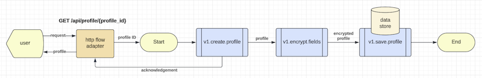
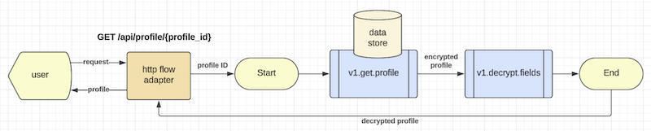
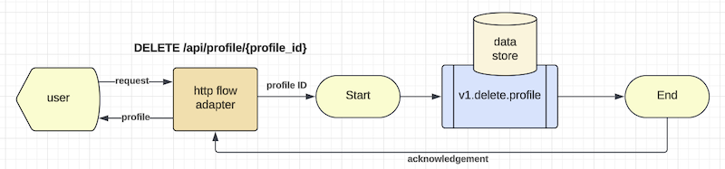

# Introduction

Mercury Composable is a software development toolkit for writing composable applications.

Composable application means that an application is assembled from modular software components or functions that
are self-contained and pluggable. You can mix-n-match functions to form new applications. You can retire outdated
functions without adverse side effect to a production system. Multiple versions of a function can exist, and you
can decide how to route user requests to different versions of a function. Applications would be easier to design,
develop, maintain, deploy, and scale.

## Composable application architecture

> Figure 1 - Composable application architecture


As shown in Figure 1, a composable application contains the following:

1. *Flow adapters*: Each flow adapter listens to requests for onwards delivery to an event manager.
2. *Event Manager*: it sends events to a set of user functions for them to work together as an application. 
3. *User functions*: these are self-contained functions with clear input and output that are immutable.

### HTTP flow adapter

A non-blocking HTTP flow adapter is built-in. For other external interface types, you can implement your own
flow adapters. e.g. Adapters for MQ, Kafka, Serverless, File based staging area, etc.

The standard HTTP flow adapter leverages the underlying REST automation system to serve user facing REST
API endpoints. For example, a hypothetical "get profile" endpoint is created like this in the "rest.yaml"
configuration file:

```yaml
  - service: "http.flow.adapter"
    methods: ['GET']
    url: "/api/profile/{profile_id}"
    flow: 'get-profile'
    timeout: 10s
    cors: cors_1
    headers: header_1
    tracing: true
```

In this REST configuration entry, the system creates a REST API endpoint for "GET /api/profile/{profile_id}".
When a request arrives at this endpoint, the HTTP request will be converted to an incoming event by the flow adapter
that routes the event to the "event manager" to execute a new instance of the "get-profile" flow.

### Flow configuration example

The event manager is driven by configuration instead of code. A hypothetical "get profile" flow is defined in
a YAML file like this:

```yaml
flow:
  id: 'get-profile'
  description: 'Get a user profile using profile ID'
  ttl: 10s
  exception: 'v1.hello.exception'

first.task: 'v1.get.profile'

tasks:
  - input:
      - 'input.path_parameter.profile_id -> header.profile_id'
    process: 'v1.get.profile'
    output:
      - 'result -> model.profile'
    description: 'Retrieve user profile from database using profile_id'
    execution: sequential
    next:
      - 'v1.decrypt.fields'

  - input:
      - 'model.profile -> dataset'
      - 'text(telephone, address) -> protected_fields'
    process: 'v1.decrypt.fields'
    output:
      - 'text(application/json) -> output.header.content-type'
      - 'result -> output.body'
    description: 'Decrypt fields'
    execution: end

  - input:
      - 'error.code -> status'
      - 'error.message -> message'
      - 'error.stack -> stack'
    process: 'v1.hello.exception'
    output:
      - 'result.status -> output.status'
      - 'result -> output.body'
    description: 'Just a demo exception handler'
    execution: end
```

Note that the flow configuration is referring user functions by their "route" names. It is because all user functions
are self-contained with clearly defined input and output and the event manager would set their inputs and collect their
outputs accordingly. Note that you can map selected key-values or the whole event as a business object and this
decoupling promotes highly reusable user functional software.

The event manager will create a "state machine" to manage each transaction flow because all user functions are
stateless. The "state machine" is referenced using the namespace "model".

### Assigning a route name to a user function

You can assign a route name to a Java class using the `PreLoad` annotation like this:

```java
@PreLoad(route="v1.get.profile", instances=100)
public class GetProfile implements TypedLambdaFunction<Map<String, Object>, Profile> {

    @Override
    public Profile handleEvent(Map<String, String> headers, Map<String, Object> input, int instance) {
        // your business logic here
        return result;
    }
}
```

Inside the "handleEvent" method, you can write regular Java code using your preferred coding style and
framework. You can define input/output as Map or PoJo.

## Building the Mercury libraries from source

Mercury Composable leverages the best of Java 21 virtual threading technology. Therefore, you would need to
install Java JDK version 21 or higher. You also need maven version 3.9.7 or higher to build the libraries.

Assuming you clone the repository into the "sandbox" directory, you may build the libraries like this.

```shell
cd sandbox/mercury-composable
mvn clean install
```

The compiled libraries will be saved to your local ".m2" maven repository. For production, you may publish
the Mercury Composable libraries into your enterprise artifactory.

We use "maven" build scripts. If your organization uses other build tools such as gradle, please convert them
accordingly.

## Things to avoid with Java 21

By default, user functions are executed using Java 21 virtual threading technology. However, for performance reason, 
there are two things that you MUST avoid:

1. *Synchronized keyword*: This will block the event loop in the Java VM, meaning that your whole application is
   blocked when the synchronized block executes.
2. *ThreadLocal*: Java 21 virtual thread is designed to be very light weight. When you use ThreadLocal variables,
   the "virtual thread" becomes heavy weighted and the Garbage Collector may have difficulties catching up.

Since Mercury provides thread management abstraction, there is no need to use the Synchronized keyword and
ThreadLocal variables. The built-in "state machine" is a better place to keep your runtime variables for each
transaction. 

Interestingly, the "Thread" and "Future" APIs are safe to use in a virtual thread.

If you are putting legacy code inside a new user function and the legacy code runs in blocking mode, you can
annotate the user function with the "KernelThreadRunner" class. This tells the system to turn on compatibility
mode to support the blocking code. The kernel thread would isolate the blocking code from the rest of the
application. However, kernel threads are limited resources. While virtual threads can support tens of thousands of
cooperative concurrent execution, kernel threads are limited to 250, depending on the number of CPU cores that the
target machine has.

## Composable application example

Let's take a test drive of a composable application example in the "examples/composable-example" subproject.

You can use your favorite IDE to run the example or execute it from a terminal using command line.

To run it from the command line, you may do this:

```shell
cd sandbox/mercury-composable/examples/composable-example
java -jar target/composable-example-4.2.0.jar
```

If you run the application from the IDE, you may execute the "main" method in the `MainApp` class under the
"com.accenture.demo.start" package folder.

The first step in designing a composable application is to draw an event flow diagram. This is similar to
a data flow diagram where the arrows are labeled with the event objects. Note that event flow diagram is
not a flow chart and thus decision box is not required. If a user function (also known as a "task") contains
decision logic, you can draw two or more output from the task to connect to the next set of functions. 
For example, label the arrows as true, false or a number starting from 1.

The composable-example application is a hypothetical "profile management system" where you can create a profile,
browse or delete it.

> Figure 2 - Create a profile



Figure 2 illustrates an event flow to create a profile. Note that the "create profile" can send acknowledgement
to the user first. It then encrypts and saves the profile into a data store.

> Figure 3 - Retrieve a profile



Figure 3 demonstrates the case to retrieve a profile. It retrieves an encrypted profile and then passes it to
the decryption decryption function to return "clear text" of the profile to the user.

> Figure 4 - Delete a profile



Figure 4 shows the case to delete a profile. It deletes a profile using the given profile ID and sends an
acknowledgement to the user.

The REST endpoints for the three use cases are shown in the "rest.yaml" configuration file under the "main/resources"
in the example subproject.

You also find the following configuration parameters in "application.properties":

```properties
rest.server.port=8100
rest.automation=true
yaml.rest.automation=classpath:/rest.yaml
yaml.flow.automation=classpath:/flows.yaml
```

The flow configuration files are shown in the "main/resources/flows" folder where you will find the flow configuration
files for the three event flows, namely get-profile.yml, delete-profile.yml and create-profile.yml.

### Starting the application

When the application starts, you will see extract of the application log like this:

```log
CompileFlows:142 - Loaded create-profile
CompileFlows:142 - Loaded delete-profile
CompileFlows:142 - Loaded get-profile
CompileFlows:144 - Event scripts deployed: 3
...
ServiceQueue:91 - PRIVATE v1.get.profile with 100 instances started as virtual threads
...
RoutingEntry:582 - GET /api/profile/{profile_id} -> [http.flow.adapter], timeout=10s, tracing=true, flow=get-profile
...
AppStarter:378 - Modules loaded in 663 ms
AppStarter:365 - Reactive HTTP server running on port-8100
```

It shows that the 3 flow configuration files are compiled as objects to optimize performance. The user functions are
loaded into the event system and the REST endpoints are rendered from the "rest.yaml" file.

### Testing the application

You can create a test user profile with this python code. Alternatively, you can also use PostMan or other means
to do this.

```python
>>> import requests, json
>>> d = { 'id': 100, 'name': 'Hello World', 'address': '100 World Blvd', 'telephone': '123-456-7890' }
>>> h = { 'content-type': 'application/json', 'accept': 'application/json' }
>>> r = requests.post('http://127.0.0.1:8100/api/profile', data=json.dumps(d), headers=h)
>>> print(r.status_code)
201
>>> print(r.text)
{
  "profile": {
    "address": "***",
    "name": "Hello World",
    "telephone": "***",
    "id": 100
  },
  "type": "CREATE",
  "secure": [
    "address",
    "telephone"
  ]
}
```

To verify that the user profile has been created, you can point your browser to

```text
http://127.0.0.1:8100/api/profile/100
```

Your browser will return the following:
```json
{
  "address": "100 World Blvd",
  "name": "Hello World",
  "telephone": "123-456-7890",
  "id": 100
}
```

You have successfully tested the two REST endpoints. Tracing information in the application log may look like this:

```log
DistributedTrace:76 - trace={path=POST /api/profile, service=http.flow.adapter, success=true, 
                            origin=202406249aea0a481d46401d8379c8896a6698a2, start=2024-06-24T22:41:23.524Z, 
                            exec_time=0.284, from=http.request, id=f6a6ae62340e43afb0a6f30445166e08}
DistributedTrace:76 - trace={path=POST /api/profile, service=event.script.manager, success=true,
                            origin=202406249aea0a481d46401d8379c8896a6698a2, start=2024-06-24T22:41:23.525Z,
                            exec_time=0.57, from=http.flow.adapter, id=f6a6ae62340e43afb0a6f30445166e08}
DistributedTrace:76 - trace={path=POST /api/profile, service=v1.create.profile, success=true,
                            origin=202406249aea0a481d46401d8379c8896a6698a2, start=2024-06-24T22:41:23.526Z,
                            exec_time=0.342, from=task.executor, id=f6a6ae62340e43afb0a6f30445166e08}
DistributedTrace:76 - trace={path=POST /api/profile, service=async.http.response, success=true,
                            origin=202406249aea0a481d46401d8379c8896a6698a2, start=2024-06-24T22:41:23.528Z,
                            exec_time=0.294, from=task.executor, id=f6a6ae62340e43afb0a6f30445166e08}
DistributedTrace:76 - trace={path=POST /api/profile, service=v1.encrypt.fields, success=true,
                            origin=202406249aea0a481d46401d8379c8896a6698a2, start=2024-06-24T22:41:23.528Z,
                            exec_time=3.64, from=task.executor, id=f6a6ae62340e43afb0a6f30445166e08}
SaveProfile:52 - Profile 100 saved
TaskExecutor:186 - TaskExecutor:262 - {
  "execution": "Run 3 tasks in 11 ms",
  "id": "a0eef12d94bd4ab3b5fd6c25e2461130",
  "flow": "get-profile",
  "tasks": [
    "v1.create.profile",
    "v1.encrypt.fields",
    "v1.save.profile"
  ],
  "status": "completed"
}
DistributedTrace:76 - trace={path=POST /api/profile, service=v1.save.profile, success=true,
                            origin=202406249aea0a481d46401d8379c8896a6698a2, start=2024-06-24T22:41:23.533Z,
                            exec_time=2.006, from=task.executor, id=f6a6ae62340e43afb0a6f30445166e08}

DistributedTrace:76 - trace={path=GET /api/profile/100, service=http.flow.adapter, success=true, 
                            origin=202406249aea0a481d46401d8379c8896a6698a2, start=2024-06-24T22:41:52.089Z,
                            exec_time=0.152, from=http.request, id=1a29105044e94cc3ac68aee002f6f429}
DistributedTrace:76 - trace={path=GET /api/profile/100, service=event.script.manager, success=true,
                            origin=202406249aea0a481d46401d8379c8896a6698a2, start=2024-06-24T22:41:52.090Z,
                            exec_time=0.291, from=http.flow.adapter, id=1a29105044e94cc3ac68aee002f6f429}
DistributedTrace:76 - trace={path=GET /api/profile/100, service=v1.get.profile, success=true,
                            origin=202406249aea0a481d46401d8379c8896a6698a2, start=2024-06-24T22:41:52.091Z,
                            exec_time=1.137, from=task.executor, id=1a29105044e94cc3ac68aee002f6f429}
DistributedTrace:76 - trace={path=GET /api/profile/100, service=v1.decrypt.fields, success=true, 
                            origin=202406249aea0a481d46401d8379c8896a6698a2, start=2024-06-24T22:41:52.093Z,
                            exec_time=1.22, from=task.executor, id=1a29105044e94cc3ac68aee002f6f429}
TaskExecutor:262 - {
  "execution": "Run 2 tasks in 7 ms",
  "id": "a0eef12d94bd4ab3b5fd6c25e2461130",
  "flow": "get-profile",
  "tasks": [
    "v1.get.profile",
    "v1.decrypt.fields"
  ],
  "status": "completed"
}
DistributedTrace:76 - trace={path=GET /api/profile/100, service=async.http.response, success=true, 
                            origin=202406249aea0a481d46401d8379c8896a6698a2, start=2024-06-24T22:41:52.095Z, 
                            exec_time=0.214, from=task.executor, id=1a29105044e94cc3ac68aee002f6f429}
```

### Main application entry point

Every application has an entry point. The MainApp in the example app contains the entry point like this:

```java
@MainApplication
public class MainApp implements EntryPoint {
   public static void main(String[] args) {
      AutoStart.main(args);
   }
   @Override
   public void start(String[] args) {
        // your startup logic here
      log.info("Started");
   }
}
```

Since your application is event driven, the main application does not need any additional code in the above
example. However, this is a good place to put application initialization code if any.

There is also a "BeforeApplication" annotation if you want to run some start up code before the event system
is started.

## Writing composable libraries

If your software module is intended to be a composable library for other applications to use, you may use
the MainApplication method to automatically initialize your library. For example, obtaining authentication
and security credentials for a platform component or database that your library uses.

Alternatively, you may use the "autostart module" method that would automatically send start command to
some composable functions in your library.

```java
@PreLoad(route="demo.library.setup")
public class DemoLibSetup implements TypedLambdaFunction<EventEnvelope, Void> {
    private static final Logger log = LoggerFactory.getLogger(DemoLibSetup.class);

    @Override
    public Void handleEvent(Map<String, String> headers, EventEnvelope input, int instance) throws Exception {
        // check the signature of the start command
        if ("start".equals(headers.get("type"))) {
            log.info("Demo library is starting");
            // put your setup business logic here
        }
        return null;
    }
}
```

The above composable function is labeled as `demo.library.setup`, you would need to add this to the
application.properties of the application that uses this library:

```shell
# comma separated list of composable module route names
modules.autostart=demo.library.setup
```

If you use application.yml, it will be a list like this:

```yaml
modules.autostart:
  - 'demo.library.setup'
```

## Dependency management

As a best practice, your user functions should not have any dependencies with other user functions.

The second principle of composable design is "zero to one dependency". If your composable function must use
an external system, platform or database, you can encapsulate the dependency in a composable function.

## Component scan

Please update the following in the application.properties (or application.yml) to include packages of your own functions:

```properties
web.component.scan=your.package.name
```

> You should replace "your.package.name" with the real package name(s) that you use in your application.
  Usually this is your organization software ID or "namespace".
  "web.component.scan" is a comma separated list of package names.

## Deploy your application

Composable design can be used to create microservices. You can put related functions in a bounded context with
database persistence.

Each composable application can be compiled and built into a single "executable" for deployment using
`mvn clean package`.

The executable JAR is in the target folder. 

Composable application is by definition cloud native. It is designed to be deployable using Kubernetes or serverless.

A sample Dockerfile for your executable JAR may look like this:

```shell
FROM eclipse-temurin:21.0.1_12-jdk
EXPOSE 8083
WORKDIR /app
COPY target/your-app-name.jar .
ENTRYPOINT ["java","-jar","your-app-name.jar"]
```

The above Dockerfile will fetch Openjdk 21 packaged in "Ubuntu 22.04 LTS".

## Event choreography by configuration

The best practice for composable design is event choreography by configuration (`Event Script`) discussed above.
We will examine the Event Script syntax in [Chapter 4](CHAPTER-4.md).

Generally, you only need to use a very minimal set of mercury core APIs in your user functions.
e.g. use PostOffice to obtain a trackable event emitter and AsyncHttpRequest to connect to external system.

For composable applications that use Event Script, Mercury core APIs (Platform and PostOffice) are only
required for writing unit tests, "custom flow adapters", "legacy functional wrappers" or "external gateways".

## Orchestration by code

*Orchestration by code is strongly discouraged because it would result in tightly coupled code*. 

For example, just an "Import" statement of another function would create tight coupling of two pieces of code, 
even when using reactive or event-driven programming styles.

However, if there is a use case that you prefer to write orchestration logic by code, you may use the Mercury core
APIs to do event-driven programming. API overview will be covered in [Chapter 9](CHAPTER-9.md).
<br/>

|          Methodology          |                   Home                    |                  Chapter-2                  |
|:-----------------------------:|:-----------------------------------------:|:-------------------------------------------:|
| [Methodology](METHODOLOGY.md) | [Table of Contents](TABLE-OF-CONTENTS.md) | [Function Execution Strategy](CHAPTER-2.md) |