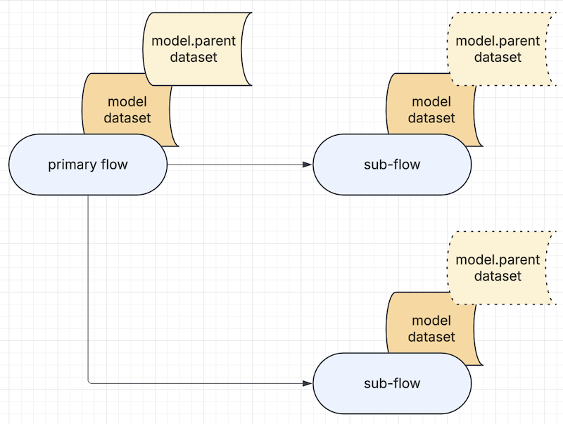
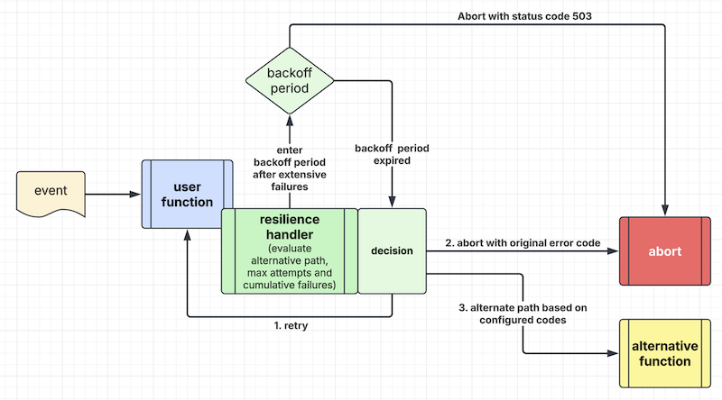

# Event Script Syntax

Event Script is a Domain Specific Language (DSL) that uses YAML to represent an end-to-end transaction flow.
A transaction is a business use case, and the flow can be an API service, a batch job or a real-time transaction.

## Flow list

This configuration file sits in the project "resources" project and contains a list of filenames.

The default flow list is "flows.yaml" under the "resources" folder. It may look like this.

```yaml
flows:
  - 'get-profile.yml'
  - 'create-profile.yml'
  - 'delete-profile.yml'

location: 'classpath:/flows/'
```

The "location" parameter is optional. If present, you can tell the system to load the flow config files from
another folder location.

## Multiple flow lists

You can provide more than one flow list to your application and it can become very handy under different
situations. For instance, to achieve better modularity in complex application, flows can be grouped to
multiple categories based on development team's choice and these flows can be managed in multiple flow
lists. Another great place to use multiple flow list is to include external libraries which contain
pre-defined flow lists. The following example demonstrates that an application loads a list of flows
defined in "flows.yaml" and additional flows defined in "more-flows.yaml" file of a composable library.

```properties
yaml.flow.automation=classpath:/flows.yaml, classpath:/more-flows.yaml
```

## Writing new REST endpoint and function

You can use the "composable-example" subproject as a template to write your own composable application.

For each filename in the flows.yml, you should create a corresponding configuration file under the
"resources/flows" folder.

Let's write a new flow called "greetings". You can copy-n-paste the following into a file called "greetings.yml"
under the "resources/flows" folder.

```yaml
flow:
  id: 'greetings'
  description: 'Simplest flow'
  ttl: 10s

first.task: 'greeting.demo'

tasks:
  - input:
      - 'input.path_parameter.user -> user'
    process: 'greeting.demo'
    output:
      - 'text(application/json) -> output.header.content-type'
      - 'result -> output.body'
    description: 'Hello World'
    execution: end
```

In the application.properties, you can specify the following parameter:

```properties
yaml.flow.automation=classpath:/flows.yaml
```

and update the "flows.yaml" file in the resources folder as follows:

```yaml
flows:
  - 'get-profile.yml'
  - 'create-profile.yml'
  - 'delete-profile.yml'
  - 'greetings.yml'
```

Then, you can add a new REST endpoint in the "rest.yaml" configuration file like this.

```yaml
  - service: "http.flow.adapter"
    methods: ['GET']
    url: "/api/greetings/{user}"
    flow: 'greetings'
    timeout: 10s
    cors: cors_1
    headers: header_1
```

The above REST endpoint takes the path parameter "user". The task executor will map the path parameter to the
input arguments (headers and body) in your function. Now you can write your new function with the named route
"greeting.demo". Please copy-n-paste the following into a Java class called "Greetings" and save in the package
under "my.organization.tasks" in the source project.

> *Note*: The package name, "my.organization", is an example. Please replace it with your organization package path.

```java
@PreLoad(route="greeting.demo", instances=10, isPrivate = false)
public class Greetings implements TypedLambdaFunction<Map<String, Object>, Map<String, Object>> {
    private static final String USER = "user";

    @Override
    public Map<String, Object> handleEvent(Map<String, String> headers, Map<String, Object> input, int instance) {
        if (input.containsKey(USER)) {
            String user = input.get(USER).toString();
            Map<String, Object> result = new HashMap<>();
            result.put(USER, user);
            result.put("message", "Welcome");
            result.put("time", new Date());
            return result;
        } else {
            throw new IllegalArgumentException("Missing path parameter 'user'");
        }
    }
}
```

For the flow-engine to find your new function, please update the key-value for "web.component.scan" in
application.properties:

```properties
web.component.scan=my.organization
```

To test your new REST endpoint, flow configuration and function, please point your browser to

```text
http://127.0.0.1:8100/api/greetings/my_name
```

You can replace "my_name" with your first name to see the response to the browser.

## Flow configuration syntax

In your "greetings.yml" file above, you find the following key-values:

`flow.id` - Each flow must have a unique flow ID. The flow ID is usually originated from a user facing endpoint
through an event adapter. For example, you may write an adapter to listen to a cloud event in a serverless deployment.
In The most common one is the HTTP adapter.

The flow ID is originated from the "rest.yaml". The `flow-engine` will find the corresponding flow configuration
and create a new flow instance to process the user request.

`flow.description` - this describes the purpose of the flow

`flow.ttl` - "Time to live (TTL)" timer for each flow. You can define the maximum time for a flow to finish processing.
All events are delivered asynchronously and there is no timeout value for each event. The TTL defines the time budget
for a complete end-to-end flow. Upon expiry, an unfinished flow will be aborted. You can use suffix "s" for seconds,
"m" for minutes and "h" for hours. e.g. "30s" for 30 seconds.

> *Note*: When using the HTTP Flow Adapter, the flow.ttl value can be higher than the REST endpoint's timeout value.
  This would happen when one of your tasks in the event flow responds to the caller and the event flow continues to
  execute the rest of the flow. This type of task is called "response" task.

`first.task` - this points to the route name of a function (aka "task") to which the flow engine will deliver
the incoming event.

The configuration file contains a list of task entries where each task is defined by "input", "process", "output"
and "execution" type. In the above example, the execution type is "end", meaning that it is the end of a transaction
and its result set will be delivered to the user.

## Underlying Event System

The Event Script system uses platform-core as the event system where it encapsulates Java Virtual Threads and
Eclipse Vertx.

The integration points are intentionally minimalist. For most use cases, the user application does not need
to make any API calls to the underlying event system.

## REST automation and HTTP flow adapter

The most common transaction entry point is a REST endpoint. The event flow may look like this:

```text
REQUEST -> "http.request" -> "task.executor" -> user defined tasks
        -> "async.http.response" -> RESPONSE
```

REST automation is part of the platform-core library. It contains a non-blocking HTTP server that converts
HTTP requests and responses into events.

It routes an HTTP request event to the HTTP adapter if the "flow" tag is provided.

In the following example, the REST endpoint definition is declared in a "rest.yaml" configuration. It will route
the URI "/api/decision" to the HTTP flow adapter that exposes its service route name as "http.flow.adapter".

```yaml
rest:
  - service: "http.flow.adapter"
    methods: ['GET']
    url: "/api/decision?decision=_"
    flow: 'decision-test'
    timeout: 10s
    cors: cors_1
    headers: header_1
    tracing: true
```

The "cors" and "headers" sections are optional. When specified, the REST endpoint will insert CORS headers and HTTP
request headers accordingly.

For REST automation syntax, please refer to [Chapter 3](../guides/CHAPTER-3.md)

The HTTP flow adapter maps the HTTP request dataset and the flow ID into a standard event envelope for delivery
to the flow engine.

The HTTP request dataset, addressable with the "input." namespace, contains the following:

| Key            | Values                                         |
|:---------------|:-----------------------------------------------|
| method         | HTTP method                                    |
| uri            | URI path                                       |
| header         | HTTP headers                                   |
| cookie         | HTTP cookies                                   |
| path_parameter | Path parameters if any                         |
| query          | HTTP query parameters if any                   |
| body           | HTTP request body if any                       |
| stream         | input stream route ID if any                   |
| ip             | remote IP address                              |
| filename       | filename if request is a multipart file upload |
| session        | authenticated session key-values if any        |

For easy matching, please use lower case for headers, cookies, query and path parameters.

Regular API uses JSON and XML and they will be converted to a hash map in the event's body.

For special use cases like file upload/download, your application logic may invoke a streaming API to retrieve
the binary payload. Please refer to [Appendix-III](../guides/APPENDIX-III.md)

## Task is a composable function

Each task in a flow must have a corresponding composable function. You can assign a task name to the function
using the `Preload` annotation like this.

```java
@PreLoad(route="greeting.demo", instances=10)
public class Greetings implements TypedLambdaFunction<Map<String, Object>, Map<String, Object>> {
    @Override
    public Map<String, Object> handleEvent(Map<String, String> headers, Map<String, Object> input, int instance) {
        // business logic here
        return someOutput;
    }
}
```

The "route" in the `Preload` annotation is the task name. The "instances" define the maximum number of "workers" that
the function can handle concurrently. The system is designed to be reactive and the function does not consume memory
and CPU resources until an event arrives.

You may also define concurrency using environment variable. You can replace the "instances" with `envInstances` using
standard environment variable syntax like `${SOME_ENV_VARIABLE:default_value}`.

## PoJo serialization strategies

The default serialization strategy is defined in application.properties as the `snake.case.serialization` parameter.
Snake case serialization will be used when this parameter is set to true. Otherwise, camel case serialization will be
used.

You can override the default serialization strategy in 2 ways in the PreLoad annotation.

1. Configure input / output serialization strategies
2. Implement your own custom serializer using the CustomSerializer interface

```java
@Target({ElementType.TYPE})
@Retention(RetentionPolicy.RUNTIME)
@Documented
public @interface PreLoad {
    String route();
    Class<?> customSerializer() default Void.class;
    Class<?> inputPojoClass() default Void.class;
    int instances() default 1;
    String envInstances() default "";
    boolean isPrivate() default true;
    SerializationStrategy inputStrategy() default SerializationStrategy.DEFAULT;
    SerializationStrategy outputStrategy() default SerializationStrategy.DEFAULT;
}
```

To instruct the composable function to deserialize input as a PoJo and serialize output PoJo, you can set the "inputStrategy" 
and/or "outputStrategy" parameters in the PreLoad annotation.

For example, when you set the inputStrategy to SerializationStrategy.CAMEL, it will override the default snake case
serialization. This is useful when your function receives input from an external source that you have no control of the
serialization strategy.

Similarly, when you are using default snake case serialization, you can set outputStrategy to SerializationStrategy.CAMEL
in the last function in a flow so that camel case output will be delivered to an external target.

If your PoJo requires special treatment and the built-in preconfigured serializer does not handle your use case, you can
implement your own custom serializer. In this case, the inputStrategy and outputStrategy will be ignored.

## Unique task naming

Composable functions are designed to be reusable. By changing some input data mapping to feed different parameters
and payload, your function can behave differently.

Therefore, it is quite common to use the same function (i.e. the `process` parameter) more than once in a single
event flow.

When a task is not named, the "process" parameter is used to name the task.

Since each task must have a unique name for event routing, we cannot use the same "process" name more than once in
an event flow. To handle this use case, you can create unique names for the same function using the `name` parameter
like this:

```yaml
flow:
  id: 'greetings'
  description: 'Simplest flow'
  ttl: 10s

first.task: 'my.first.task'

tasks:
  - name: 'my.first.task'
    input:
      - 'input.path_parameter.user -> user'
    process: 'greeting.demo'
    output:
      - 'text(application/json) -> output.header.content-type'
      - 'result -> output.body'
    description: 'Hello World'
    execution: sequential
    next:
      - 'another.task'
```

The above event flow configuration uses "my.first.task" as a named route for "greeting.demo" by adding the
"name" parameter to the composable function.

> *Note*: The Event Manager performs event choreography using the unique task name.
  Therefore, when the "process" name for the function is not unique, you must create unique task "names"
  for the same function to ensure correct routing.

## Assigning multiple route names to a single function

The built-in distributed tracing system tracks the actual composable functions using the "process" name
and not the task names.

When there is a need to track the task names in distributed trace, you can tell the system to create
additional instances of the same function with different route names.

You can use a comma separated list as the route name like this:

```java
@PreLoad(route="greeting.case.1, greeting.case.2", instances=10)
public class Greetings implements TypedLambdaFunction<Map<String, Object>, Map<String, Object>> {
    
  @Override
  public Map<String, Object> handleEvent(Map<String, String> headers, Map<String, Object> input, int instance) {
      // business logic here
      return someResult;
  }
}
```

> *Note*: The "unique task naming" method is more memory efficient than creating additional route names

## Preload overrides

Once a composable function is published as a reusable library in the artifactory, its route name and
number of instances are fixed using the "PreLoad" annotation in the function class.

Without refactoring your libary, you can override its route name and instances using a preload override
file like this:

```yaml
preload:
  - original: 'greeting.demo'
    routes:
      - 'greeting.case.1'
      - 'greeting.case.2'
    # the "instances" tag is optional
    instances: 20
  - original: 'v1.another.reusable.function'
    keep-original: true
    routes:
      - 'v1.reusable.1'
      - 'v1.reusable.2'
```

In the above example, the function associated with "greeting.demo" will be preloaded as "greeting.case.1"
and "greeting.case.2". The number of maximum concurrent instances is also changed from 10 to 20.

In the second example, "v1.another.reusable.function" is updated as "v1.reusable.1" and "v1.reusable.2"
and the number of concurrent instances is not changed. The original route "v1.another.reusable.function" is
preserved when the "keep-original" parameter is set to true.

Assuming the above file is "preload-override.yaml" in the "resources" folder of the application source code
project, you should add the following parameter in application.properties to activate this preload override
feature.

```properties
yaml.preload.override=classpath:/preload-override.yaml
```

## Multiple preload override config files

When you publish a composable function as a library, you may want to ensure the route names of the functions are
merged properly. In this case, you can bundle a library specific preload override config file.

For example, your library contains a "preload-kafka.yaml" to override some route names, you can add it to the
yaml.preload.override parameter like this:

```properties
yaml.preload.override=classpath:/preload-override.yaml, classpath:/preload-kafka.yaml
```

The system will then merge the two preload override config files.

The concurrency value of a function is overwritten using the "instances" parameter in the first preload override file.
Subsequent override of the "instances" parameter is ignored. i.e. the first preload override file will take precedence.

## Hierarchy of flows

As shown in Figure 1, you can run one or more sub-flows inside a primary flow.



> Figure 1 - Hierarchy of flows

To do this, you can use the flow protocol identifier (`flow://`) to indicate that the task is a flow.

For example, when running the following task, "flow://my-sub-flow" will be executed like a regular task.

```yaml
tasks:
  - input:
      - 'input.path_parameter.user -> header.user'
      - 'input.body -> body'
    process: 'flow://my-sub-flow'
    output:
      - 'result -> model.pojo'
    description: 'Execute a sub-flow'
    execution: sequential
    next:
      - 'my.next.function'
```

If the sub-flow is not available, the system will throw an error stating that it is not found.

Hierarchy of flows would reduce the complexity of a single flow configuration file. The "time-to-live (TTL)"
value of the parent flow should be set to a value that covers the complete flow including the time used in
the sub-flows.

In the input/output data mapping sections, the configuration management system provides a parent
state machine using the namespace `model.parent.` to be shared by the primary flow and all sub-flows that
are instantiated from it.

> *Note*: The input data mapping for a "sub-flow" task should contain only the "header" and "body" arguments
          to be mapped in the "input" namespace.

## Tasks and data mapping

All tasks for a flow are defined in the "tasks" section.

### Input/Output data mapping

A function is self-contained. This modularity reduces application complexity because the developer only needs
interface contract details for a specific function.

To handle this level of modularity, the system provides configurable input/output data mapping.

*Namespaces for I/O data mapping*

| Type                              | Keyword and/or namespace     | LHS / RHS  | Mappings |
|:----------------------------------|:-----------------------------|------------|----------|
| Flow input dataset                | `input.`                     | left       | input    |
| Flow output dataset               | `output.`                    | right      | output   |
| Function input body               | no namespace required        | right      | input    |
| Function input or output headers  | `header` or `header.`        | both       | I/O      |
| Function output result set        | `result.`                    | left       | output   |
| Function output status code       | `status`                     | left       | output   |
| Function output pojo class name   | `datatype`                   | left       | output   |
| Decision value                    | `decision`                   | right      | output   |
| State machine dataset             | `model.`                     | both       | I/O      |
| Parent state machine dataset      | `model.parent.`              | both       | I/O      |
| External state machine key-value  | `ext:`                       | right      | I/O      |

For state machine (model and model.parent namespaces), the system prohibits access to the whole
namespace. You should only access specific key-values in the model or model.parent namespaces.

The namespace `model.parent.` is shared by the primary flow and all sub-flows that are instantiated from it.

When your function returns a PoJo, the `datatype` field in the left-hand-side will contain
the class name of the PoJo. This allows you to save the class name in the state machine and
pass it to another task that needs to reconstruct the PoJo class. This is used when your
function may return different PoJo classes for different scenarios.

The external state machine namespace uses the namespace `ext:` to indicate that the key-value is external.

*Constants for input data mapping*

| Type      | Keyword for the left-hand-side argument              |
|:----------|:-----------------------------------------------------|
| String    | `text(example_value)`                                |
| Integer   | `int(number)`                                        |
| Long      | `long(number)`                                       |
| Float     | `float(number)`                                      |
| Double    | `double(number)`                                     |
| Boolean   | `boolean(true or false)`                             |
| Map       | `map(k1=v1, k2=v2)`<br>`map(base.config.parameter)`  |
| File      | `file(text:file_path)`                               |
| File      | `file(binary:file_path)`                             |
| File      | `file(json:file_path)`                               |
| Classpath | `classpath(text:file_path)`                          |
| Classpath | `classpath(binary:file_path)`                        |
| Classpath | `classpath(json:file_path)`                          |

For input data mapping, the "file" constant type is used to load some file content as an argument of a user function.
You can tell the system to render the file as "text", "binary" or "json". Similarly, the "classpath" constant type
refers to static file in the application source code's "resources" folder. When file type mapping is "json", the
file content will be rendered as a Map or a List from a JSON string.

The "map" constant type is used for two purposes:

*1. Map of key-values*

The following example illustrates creation of a map of key-values. In the first entry, a map of 2 key-values
is set as the input argument "myMap" of a user function. In the second entry, the map's values are retrieved
from the key "some.key" in base configuration and the environment variable "ENV_VAR_ONE".

```text
'map(k1=v1, k2=v2) -> myMap'
'map(k1=${some.key}, k2=${ENV_VAR_ONE}) -> myMap'
```

> *Note*: The comma character is used as a separator for each key-value pair. If the value contains a comma,
  the system cannot parse the key-values correctly. In this case, please use the 2nd method below.

*2. Mapping values from application.yml*

The following input data mapping sets the value of "my.key" from the application.yml base configuration file
to the input argument "myKey" of a user function.

```text
'map(my.key) -> myKey'
```

Since the system uses both application.properties and application.yml as base configuration files,
you can use either configuration files depending on the data type of the value.

For application.properties, "map(my.key)" is the same as "text(${my.key})".

For application.yml, "map(my.key)" would set a primitive value (text, integer, float, boolean), 
a hash map of key-values or an array of values.

*Special content type for output data mapping*

| Type   | Keyword for the right-hand-side argument |
|:-------|:-----------------------------------------|
| File   | `file(file_path)`                        |
| File   | `file(append:file_path)`                 |

For output data mapping, the "file" content type is used to save some data from the output of a user function
to a file in the local file system. If the left-hand-side (LHS) resolved value is null, the file in the RHS
will be deleted. This allows you to clean up temporary files before your flow finishes.

An optional prefix "append" may be used to tell the system to append file content instead of overwriting it.

> *Note*: The local file system write operation is not thread-safe. If you have parallel tasks appending
          to the same file, the integrity of file content is not guaranteed. One way to ensure thread
          safety is to use singleton pattern. This can be done by setting the number of instances of the
          task writing to the local file system to 1.

*Decision value*

The "decision" keyword applies to "right hand side" of output data mapping statement in a decision task only
(See "Decision" in the task section).

*Each flow has its own input and output*

Each function has its input headers, input body and output result set.
Optionally, a function can return an EventEnvelope object to hold its result set in the "body", a "status" code
and one or more header key-values.

Since each function is stateless, a state machine (with namespace `model.`) is available as a temporary memory store
for transaction states that can be passed from one task to another.

All variables are addressable using the standard dot-bracket convention.

For example, "hello.world" will retrieve the value `100` from this data structure:
```json
{
  "hello":  {
    "world": 100
  }
}
```

and "numbers[1]" will retrieve the value `200` below:
```json
{ "numbers":  [100, 200] }
```

The assignment is done using the assignment (`->`) syntax.

In the following example, the HTTP input query parameter 'amount' is passed as input body argument 'amount'
to the task 'simple.decision'. The result (function "return value") from the task will be mapped to the
special "decision" variable that the flow engine will evaluate. This assumes the result is a boolean or
numeric value.

The "decision" value is also saved to the state machine (`model`) for subsequent tasks to evaluate.

```yaml
  - input:
      - 'input.query.amount -> amount'
    process: 'simple.decision'
    output:
      - 'result -> decision'
      - 'result -> model.decision'
```

### Environment variables

You can use the standard `${ENV_VAR:default}` syntax to resolve environment variables or parameters from
the application.properties.

### Runtime model variables

To use a runtime model variable value as a key or constant, you can use the `{model.variable_name}` syntax.

For example,
```yaml
  - input:
      - 'text(wonderful day) -> model.world'
      - 'text(world) -> model.pointer'
      - 'model.{model.pointer} -> value1'
      - 'text(new {model.pointer}) -> value2' 
      - 'text(keep {this}/{one} unchanged) -> value3'  
    process: 'demo.function'
```

`model.{model.pointer}` is resolved as `model.world`, giving value1 = `wonderful day` and
value2 = `new world`. 

The text inside a set of brackets that is not a model variable will be kept unchanged, 
thus value3 = `keep {this}/{one} unchanged`

The use of string substitution is subject to event script syntax validation. Therefore,

1. When this feature is used in the left-hand-side of an input data mapping, it can be used to substitute a constant 
   or a segment of a key in the `input.` and `model.` namespaces. The above example shows the use of the
   model namespace in `model.{model.pointer} -> value1`.
2. Similarly, when used in the left-hand-side of an output data mapping, it can be used to substitute a constant
   or a segment of a key in the `input.`, `model.`, `header.` or `result.` namespaces.
3. When used in the right-hand-side of an input data mapping, namespace is optional because it may map as an argument
   to a task.
4. When used in the right-hand-side of an output data mapping, it can be used to substitute a `model.` namespace,
   `file(` output, flow `output.` namespace or an external state machine `ext:` namespace.

*Important*:

1. For security reason, the key inside the brackets must be a model variable.
2. The resolved value from a model variable must be either text or number.
   Otherwise, it will be converted to a value of "null".
3. For simplicity, nested substitution is not allowed. 
   i.e. `model.{model.{model.n}}` or `model.{model.list[model.n]}` will be rejected.
4. If the bracketed text is not a model variable, the brackets and the enclosed text will be kept unchanged.

### Handling arrays in a dataset

An array of data elements is expressed as a list.

```json
{ "numbers":  [100, 200] }
```

As discussed earlier, an array element can be retrieved using a number as index. For example, to take
the second element with value 200 above, you can use this data mapping like this:

```yaml
- 'input.body.numbers[1] -> second_number'
```

In the above example, it is an "input data mapping". It maps the second element of value 200 as the
input argument "second_number" to a composable function.

For-loop feature is supported in pipeline in an event flow. It would be convenient to use the
iterator value as an index to map an input argument. We can do something like this:

```yaml
- 'input.body.numbers[model.n] -> second_number'
```
where `model.n` is the iterator value in a for-loop.

Similarly, it is possible to do output data mapping. For example,

```yaml
- 'result.computed -> model.list[model.n]'
```

To address an array element, we can use a number or a "dynamic model variable" as an index.
The model variable must resolved to a number.

> *Note*: There are some consideration when using a dynamic model variable as an index. The left-hand-side
          of a data mapping is a GET operation. The right-hand-side is a SET operation. If the model
          variable is non-numeric, the GET operation will return null and SET operation will throw
          exception. To avoid setting an arbitrary high index, the size of the index is limited by
          the parameter "max.model.array.size" in application.properties or application.yml

### Append an element to an array

An empty array index in the right hand side tells the system to append an element to an array.
For example, the value resolved from the left hand side "result.item1" and "result.item2" will be appended
to the model.items array in the state machine.

```yaml
- 'result.item1 -> model.items[]'
- 'result.item2 -> model.items[]'
```

If model.items does not exist, the first element will be set as array index "0". Therefore, the above output
data mapping statements are the same as:

```yaml
- 'result.item1 -> model.items[0]'
- 'result.item2 -> model.items[1]'
```

### Simple type matching and conversion

Event script's state machine supports simple type matching and conversion for the model namespace.

This "impedance matching" feature allows us to accommodate minor interface contract changes without
refactoring business logic of a user function.

This is supported in both the left-hand-side and right-hand-side of both input and output data mappings.

For the left-hand-side, the state machine's model value is matched or converted to the target data type before
setting the value of the right-hand-side. The state machine values are unchanged.

For the right-hand-side, the matched or converted value is applied to the state machine's model value.

The syntax is `model.somekey:type` where "type" is one of the following:

| Type                  | Match value as                | Example                               |
|:----------------------|:------------------------------|:--------------------------------------|
| text                  | text string                   | model.someKey:text                    |
| binary                | byte array                    | model.someKey:binary                  |
| int                   | integer or -1 if not numeric  | model.someKey:int                     |
| long                  | long or -1 if not numeric     | model.someKey:long                    |
| float                 | float or -1 if not numeric    | model.someKey:float                   |
| double                | double or -1 if not numeric   | model.someKey:double                  |
| boolean               | true or false                 | model.someKey:boolean                 |
| boolean(value)        | true if value matches         | model.someKey:boolean(positive)       |
| boolean(value=true)   | true if value matches         | model.someKey:boolean(positive=true)  |
| boolean(value=false)  | false if value matches        | model.someKey:boolean(negative=false) |
| and(model.key)        | boolean AND of 2 model keys   | model.someKey:and(model.another)      |
| or(model.key)         | boolean OR of 2 model keys    | model.someKey:or(model.another)       |
| !model.key            | negate of a model variable    | !model.someKey                        |
| substring(start, end) | extract a substring           | model.someKey:substring(0, 5)         |
| substring(start)      | extract a substring           | model.someKey:substring(5)            |
| concat(vars...)       | concat model variables & text | model.a:concat(model.b, text(!))      |
| b64                   | byte-array to Base64 text     | model.someKey:b64                     |
| b64                   | Base64 text to byte-array     | model.someKey:b64                     |
| uuid                  | generated UUID-4 value        | model.unique_id:uuid                  |
| length                | length of model list variable | model.someList:length                 |

For Base64 type matching, it handles two symmetrical use cases. If the key-value is a text string,
the system would assume it is a Base64 text string and convert it to a byte-array. If the key-value
is a byte-array, the system will encode it into a Base64 text string.

For uuid type matching, the system will ignore the value of the model variable in the left hand
side because UUID is a generated value. When using it in the right hand side, the model variable
will be updated with a generated UUID value accordingly.

For simplicity of syntax, each type matching command is a single operation. For more complex
operation such as multiple AND, OR and NEGATE operators, you can configure multiple steps of
operation.

For string concatenation, you may concat a model variable with one or more model variables and
text constants. The latter uses the "text(some value)" format.

An interesting use case is a simple decision task using the built-in no-op function.
For boolean with value matching, you can test if the key-value in the left-hand-side is a null
value. For example, when a control file for the application is not available, your application will
switch to run in dev mode.

A sample task may look like this:

```yaml
first.task: 'no.op'

tasks:
- input:
    - 'file(binary:/tmp/interesting-config-file) -> model.is-local:boolean(null=true)'
  process: 'no.op'
  output:
    - 'model.is-local -> decision'
  execution: decision
  next:
    - 'start.in.dev.mode'
    - 'start.in.cloud'
```

Another use case is type conversion for HTTP path parameter which is always a text string.
If your composable function requires a path parameter to be accepted as an integer, you can do this:

```yaml
- input:
    - 'input.path_parameter.userid -> model.userid:int'
    - 'model.userid -> userid'
```

The above input data mapping example illustrates the use of a model variable to convert a text parameter
into an integer. Note that if the path parameter is not numeric, the converted value will be -1.

> *Note*: The system only supports "type matching modifier" in the model namespace because of
          the design principle of data immutability. The model is a state machine for a flow instance.
          As a temporary store, we can use it for this purpose without side effect that the user application
          would accidentally modify a value of the flow's input.

### Convenient data mapping using model variable

To address the common use case of using a model variable as an intermediate value, the system supports the following
formats for input data mapping and output data mapping.

```text
// 2-part data mapping format
LHS -> RHS
// 3-part data mapping format
LHS -> model.variable -> RHS
```

For the 2-part data mapping format, there are left-hand-side and right-hand-side where the value retrieved
from the left-hand-side variable is mapped to the right-hand-side.

The 3-part data mapping allows us to use a model variable as an intermediate for simple type matching.

In the previous example, it uses two entries to convert a HTTP path parameter from a text string to a number and
set the number as input argument. The configuration syntax can be simplified as follows:

```yaml
- input:
    - 'input.path_parameter.userid -> model.userid:int -> userid'
```

The above 3-part data mapping entry will be expanded into two entries internally. This extra processing is done
at the "CompileFlows" step and thus there is no impact to the task execution speed.

Please note that the 3-part data mapping format is not supported when the left-hand-side is a text constant.
It is because a text constant may contain any special characters including the mapping signature `->`.

### Metadata for each flow instance

For each flow instance, the state machine in the "model" namespace provides the following metadata that
you can use in the input/output data mapping. For example, you can set this for an exception handler to
log additional information.

| Type             | Keyword          | Comment                                    |
|:-----------------|:-----------------|:-------------------------------------------|
| Flow ID          | `model.flow`     | The ID of the event flow config            |
| Trace ID         | `model.trace`    | Optional traceId when tracing is turned on |
| Correlation ID   | `model.cid`      | Correlation ID of the inbound request      |

### Special handling for header

When function input keyword `header` is specified in the "right hand side" of an input data mapping statement,
it refers to the input event envelope's headers. Therefore, it assumes the "left hand side" to resolve into
a Map object of key-values. Otherwise, it will reject the input data mapping statement with an error like this:

```text
Invalid input mapping 'text(ok) -> header', expect: Map, Actual: String
```

When function input namespace `header.` is used, the system will map the value resolved from the "left hand side"
statement into the specific header.

For example, the input data mapping statement `text(ok) -> header.demo` will set "demo=ok" into the input event
envelope's headers.

When function output keyword `header` is specified in the "left hand side" of an output data mapping statement,
it will resolve as a Map from the function output event envelope's headers.

Similarly, when function output namespace `header.` is used, the system will resolve the value from a specific
key of the function output event envelope's headers.

### Function input and output

To support flexible input data mapping, the input to a function must be either `Map<String, Object>` or `PoJo`.
However, the output (i.e. result set) of a function can be Map, PoJo or Java primitive.

Your function should implement the `TypedLambdaFunction` interface to configure input and output.

Since a data structure is passed to your function's input argument as key-values, you may create a PoJo class
to deserialize the data structure.

To tell the system that your function is expecting input as a PoJo, you can use the special notation `*` on
the right hand side.

For example, the following entry tells the system to set the value in "model.dataset" as a PoJo input.

```yaml
  - input:
      - 'model.dataset -> *'
```

> *Note*: If the value from the left hand side is not a map, the system will ignore the input mapping command and
print out an error message in the application log.

### Setting function input headers

When function input body is used to hold a PoJo, we may use function input headers to pass other arguments
to the function without changing the data structure of a user defined PoJo.

In the following example, the HTTP query parameter "userid" will be mapped to the function input header
key "user" and the HTTP request body will be mapped to the function input body.

```yaml
  - input:
      - 'input.query.userid -> header.user'
      - 'input.body -> *'
    process: 'my.user.function'
    output:
      - 'text(application/json) -> output.header.content-type'
      - 'result -> output.body'
```

## Task types

### Decision task

A decision task makes decision to select the next task to execute. It has the tag `execution=decision`.

In the output data mapping section, it must map the corresponding result set or its key-value to the `decision` object.

The "next" tag contains a list of tasks to be selected based on the decision value.

If decision value is boolean, a `true` value will select the first task. Otherwise, the second task will be selected.

If decision value is an integer, the number should *start from 1* where the corresponding "next" task
will be selected.

```yaml
tasks:
  - input:
      - 'input.query.decision -> decision'
    process: 'simple.decision'
    output:
      - 'result -> model.decision'
      - 'result -> decision'
    description: 'Simple decision test'
    execution: decision
    next:
      - 'decision.case.one'
      - 'decision.case.two'
```

### Response task

A response task will provide result set as a flow output or "response". A response task allows the flow to respond
to the user or caller immediately and then move on to the next task asynchronously. For example, telling the user
that it has accepted a request and then moving on to process the request that may take longer time to run.

A response task has the tag `execution=response` and a "next" task.

```yaml
tasks:
  - input:
      - 'input.path_parameter.user -> user'
      - 'input.query.seq -> sequence'
    process: 'sequential.one'
    output:
      - 'result -> model.pojo'
      - 'result -> output.body'
    description: 'Pass a pojo to another task'
    execution: response
    next:
      - 'sequential.two'
```

### End task

An end task indicates that it is the last task of the transaction processing in a flow. If the flow has not executed
a response task, the end task will generate the response. Response is defined by output data mapping.

This task has the tag `execution=end`.

For example, the greeting task in the unit tests is an end task.
```yaml
    - input:
        - 'input.path_parameter.user -> user'
      process: 'greeting.demo'
      output:
        - 'text(application/json) -> output.header.content-type'
        - 'result -> output.body'
      description: 'Hello World'
      execution: end
```

### Sequential task

Upon completion of a sequential task, the next task will be executed.

This task has the tag `execution=sequential`.

In the following example, `sequential.two` will be executed after `sequential.one`.
```yaml
tasks:
  - input:
      - 'input.path_parameter.user -> user'
      - 'input.query.seq -> sequence'
    process: 'sequential.one'
    output:
      - 'result -> model.pojo'
    description: 'Pass a pojo to another task'
    execution: sequential
    next:
      - 'sequential.two'
```

### Parallel task

Upon completion of a `parallel` task, all tasks in the "next" task list will be executed in parallel.

This task has the tag `execution=parallel`.

In this example, `parallel.one` and `parallel.two` will run after `begin.parallel.test`
```yaml
tasks:
  - input:
      - 'int(2) -> count'
    process: 'begin.parallel.test'
    output: []
    description: 'Setup counter for two parallel tasks'
    execution: parallel
    next:
      - 'parallel.one'
      - 'parallel.two'
```

### Fork-n-join task

Fork-n-join is a parallel processing pattern.

A "fork" task will execute multiple "next" tasks in parallel and then wait for the result sets before running
the "join" task.

This task has the tag `execution=fork`. It must have a list of "next" tasks and a "join" task.

It may look like this:
```yaml
tasks:
  - input:
      - 'input.path_parameter.user -> user'
      - 'input.query.seq -> sequence'
    process: 'sequential.one'
    output:
      - 'result -> model.pojo'
    description: 'Pass a pojo to another task'
    execution: fork
    next:
      - 'echo.one'
      - 'echo.two'
    join: 'join.task'
```

### Dynamic fork-n-join task

A special version of the fork-n-join pattern is called `dynamic fork-n-join` which refers to parallel processing
of multiple instances of the same "next" task for each element in a list.

For example, you have a list of 100 elements in an incoming request and each element would be processed by the
same backend service. You want to process the 100 elements in parallel by multiple instances of a service wraper
that connects to the backend service.

The use case can be configured like this:
```yaml
tasks:
  - input:
      - 'input.elements -> elements'
    process: 'data.validation'
    output:
      - 'result.elements -> model.elements'
    description: 'Validate list of elements'
    execution: fork
    source: 'model.elements'    
    next:
      - 'element.processor'
    join: 'join.task'

  - name: 'element.processor'
    input:
      - 'model.elements.ITEM -> item'
      - 'model.elements.INDEX -> index'
    process: 'v1.element.processor'
    output: []
    description: 'Hello world'
    execution: sink    
```

To handle this special use case, you can add a `source` parameter in the fork task. The "source" parameter
tells the system which model variable holds the list of elements. You should only configure a single "next"
task. The system will spin up parallel instances of the `next` task to handle each element from the model
variable containing the list.

In the input data mapping section, there are two special suffixes `.ITEM` and `.INDEX`. The system will iterate
the list of elements and spin up an instance of the "next" task to retrieve the element (item) and index of
the element in the list. The two special suffixes are relevant only when adding to the model variable configured
in the "source" parameter.

> *Note*: the model variables with special suffixes '.ITEM' and '.INDEX' are virtual objects for the purpose
          of mapping as input arguments to a task. They cannot be used as regular model variables.

### Sink task

A sink task is a task without any next tasks. Sink tasks are used by fork-n-join and pipeline tasks as reusable modules.

This task has the tag `execution=sink`.
```yaml
  - input:
      - 'text(hello-world-two) -> key2'
    process: 'echo.two'
    output:
      - 'result.key2 -> model.key2'
    description: 'Hello world'
    execution: sink
```

### Special consideration for parallelism

The execution types (parallel and fork-n-join) are designed for parallel processing.

Usually, parallel processing would improve performance. However, spinning up a large number of
concurrent sessions to a slower backend service may create performance bottleneck. In fact, a 
massive number of concurrent sessions to a single backend would bring down the target service. 
This is an unintended "denial of service" attack. 

The dynamic fork-n-join execution style should be handled with caution because it can easily
spin up a large number of parallel instances of the same task.

To control parallelism, you can set a smaller number of concurrent "instances" for the "next" task
using the "instances" parameter in the "PreLoad" annotation of the task. For example, you have 100
elements in a list but the maximum instances of the task can be set to 20. This would reduce the
concurrency to 20, thus allowing you to manage performance according to available infrastructure resources. 
Therefore, processing 100 elements would require 5 rounds of 20 parallel executions and this orderly
execution is supported by the underlying reactive event system.

## Pipeline feature

Pipeline is an advanced feature of Event Script.

### Pipeline task

A pipeline is a list of tasks that will be executed orderly within the current task.

When the pipeline is done, the system will execute the "next" task.

This task has the tag `execution=pipeline`.
```yaml
tasks:
  - input:
      - 'input.path_parameter.user -> user'
      - 'input.query.seq -> sequence'
    process: 'sequential.one'
    output:
      - 'result -> model.pojo'
    description: 'Pass a pojo to another task'
    execution: pipeline
    pipeline:
      - 'echo.one'
      - 'echo.two'
    next:
      - 'echo.three'
```

Some special uses of pipelines include "for/while-loop" and "continue/break" features.

### Simple for-loop

In the following example, the `loop.statement` contains a for-loop that uses a variable in the state machine to
evaluate the loop.

In this example, the pipeline will be executed three times before passing control to the "next" task.
```yaml
tasks:
  - input:
      - 'input.path_parameter.user -> user'
      - 'input.query.seq -> sequence'
    process: 'sequential.one'
    output:
      - 'result -> model.pojo'
    description: 'Pass a pojo to another task'
    execution: pipeline
    loop:
      statement: 'for (model.n = 0; model.n < 3; model.n++)'
    pipeline:
      - 'echo.one'
      - 'echo.two'
      - 'echo.three'
    next:
      - 'echo.four'
```

### Simple while loop

The `loop.statement` may use a "while loop" syntax like this:

```yaml
    loop:
      statement: 'while (model.running)'
```

To exit the above while loop, one of the functions in the pipeline should return a boolean "false" value with
output "data mapping" to the `model.running` variable.

### For loop with break/continue decision

In the following example, the system will evaluate if the `model.quit` variable is true.
If yes, the `break` or `continue` condition will be executed.

The state variable is obtained after output data mapping and any task in the pipeline can set a key-value for
mapping into the state variable.

```yaml
tasks:
  - input:
      - 'input.path_parameter.user -> user'
      - 'input.query.seq -> sequence'
    process: 'sequential.one'
    output:
      - 'result -> model.pojo'
    description: 'Pass a pojo to another task'
    execution: pipeline
    loop:
      statement: 'for (model.n = 0; model.n < 3; model.n++)'
      condition: 'if (model.quit) break'
    pipeline:
      - 'echo.one'
      - 'echo.two'
      - 'echo.three'
    next:
      - 'echo.four'
```

Note that the "condition" parameter can be a single condition or a list of conditions.
In the following example, the system will evaluate both the model.quit and model.jump values.

```yaml
    loop:
      statement: 'for (model.n = 0; model.n < 3; model.n++)'
      condition: 
        - 'if (model.quit) break'
        - 'if (model.jump) break'
```

## Handling exception

You can define exception handler at the top level or at the task level.

Exception is said to occur when a user function throws exception or returns an EventEnvelope object with
a status code equals to or larger than 400.

The event status uses the same numbering scheme as HTTP exception status code.
Therefore, status code less than 400 is not considered an exception.

### Top-level exception handler

Top-level exception handler is a "catch-all" handler. You can define it like this:

```yaml
flow:
  id: 'greetings'
  description: 'Simplest flow of one task'
  ttl: 10s
  exception: 'v1.my.exception.handler'
```

In this example, the `v1.my.exception.handler` should point to a corresponding exception handler that you provide.

The following input arguments will be delivered to your function when exception happens.

| Key     | Description                  |
|:--------|:-----------------------------|
| status  | Exception status code        |
| message | Error message                |
| stack   | Stack trace in a text string |

The exception handler function can be an "end" task to abort the transaction or a decision task
to take care of the exception. For example, the exception handler can be a "circuit-breaker" to retry a request.

> *Note*: for efficiency, stack trace transport is limited to the first 10 lines.

### Task-level exception handler

You can attach an exception handler to a task. One typical use is the "circuit breaker" pattern.
In the following example, the user function "breakable.function" may throw an exception for some error condition.
The exception will be caught by the "v1.circuit.breaker" function.

```yaml
  - input:
      - 'input.path_parameter.accept -> accept'
      - 'model.attempt -> attempt'
    process: 'exception.simulator'
    output:
      - 'int(0) -> model.attempt'
      - 'text(application/json) -> output.header.content-type'
      - 'result -> output.body'
    description: 'This demo function will break until the "accept" number is reached'
    execution: end
    exception: 'resilience.handler'
```

The configuration for the circuit breaker function may look like this:

```yaml
  - input:
      - 'error.code -> status'
      - 'error.message -> message'
      - 'model.attempt -> attempt'
      - 'int(2) -> max_attempts'
    process: 'resilience.handler'
    output:
      - 'result.attempt -> model.attempt'
      - 'result.decision -> decision'
      - 'result.status -> model.status'
      - 'result.message -> model.message'
    description: 'Just a demo circuit breaker'
    execution: decision
    next:
      - 'breakable.function'
      - 'abort.request'
```

An exception handler will be provided with the "error" object that contains error code, error message and a
stack trace. The exception handler can inspect the error object to make decision of the next step.

For circuit breaker, we can keep the number of retry attempts in the state machine under "model.attempt" or any
key name that you prefer. In the above example, it sets an integer constant of 2 for the maximum attempts.

The circuit breaker can then evaluate if the number of attempts is less than the maximum attempts. If yes, it will
return a decision of "true" value to tell the system to route to the "breakable.function" again. Otherwise, it will
return a decision of "false" value to abort the request.

A more sophisticated circuit breaker may be configured with "alternative execution paths" depending on the error
status and stack trace. In this case, the decision value can be a number from 1 to n that corresponds to the "next"
task list.

Exception handlers may be used in both queries and transactions. For a complex transaction, the exception handler
may implement database rollback logic or recovery mechanism.

### Best practice

When a task-level exception handler throws exception, it will be caught by the top-level exception handler, if any.

A top-level exception handler should not throw exception. Otherwise it may go into an exception loop.

Therefore, we recommend that an exception handler should return regular result set in a PoJo or a Map object.

An example of task-level exception handler is shown in the "HelloException.class" in the "task" folder
where it set the status code in the result set so that the system can map the status code
from the result set to the next task or to the HTTP output status code.

## Advanced features

### No-operation function

A convenient no-operation function with the route name `no.op` is available. It can be used when you want
to perform some input/output data mapping without executing any business logic.

### Generic resilience handler function

Another useful built-in function is a resilience handler with the route name `resilience.handler`.

It is a generic resilience handler. It will retry, abort, use an alternative path or exercise a brief backoff.



> Figure 2 - Resilience Handler

The following parameters (input data mapping) define behavior for the handler:

 1. `max_attempts` - when the handler has used all the attempts, it will abort.
 2. `attempt` - this tells the handler how many attempts it has tried
 3. `status` - you should map the error status code in this field
 4. `message` - you should map the error message in this field
 5. `alternative` - the optional codes and range of status codes to tell the handler to reroute
 6. `delay` - the delay in milliseconds before exercising retry or reroute. Minimum value is 10 ms.
              Delay is skipped for the first retry. This slight delay is a protection mechanism.
 
Optional backoff behavior:
 
 1. `cumulative` - the total number of failures since last success or backoff reset if any
 2. `backoff` - the time of a backoff period (epoch milliseconds) if any
 3. `backoff_trigger` - the total number of failures that triggers a backoff
 4. `backoff_seconds` - the time to backoff after an abort has occurred.
    During this period, It will abort without updating attempt.
    This avoids overwhelming the target service that may result in recovery storm.
 
Return value (output data mapping):

 1. `result.attempt` - the handler will clear or increment this counter
 2. `result.cumulative` - the handler will clear or increment this counter. 
                          Not set if "backoff_trigger" is not given in input.
 3. `result.decision` - 1, 2 or 3 where 1=retry, 2=abort, 3=reroute that corresponds to the next tasks
 4. `result.status` - the status code that the handler aborts the retry or reroute. Not set if retry or reroute.
 5. `result.message` - the reason that the handler aborts the retry or reroute. Not set if retry or reroute.
 6. `result.backoff` - the time of a backoff period (epoch milliseconds). Not set if not in backoff mode.
 
 > *Note*: "result.attempt" should be saved in the state machine with the "model." namespace.
           "result.cumulative" and "result.backoff" should be saved in the temporary file system
           or an external state machine.

For more details, please refer to the event script `resilience-demo.yml` in the event-script-engine's 
test resources folder and the unit test `resilienceHandlerTest()` under the FlowTests class.

Extract of the task configuration for the resilience handler is shown as follows. 
In the following example, "my.task" is the function that is configured with the 'resilience.handler' as an exception
handler. The input data mapping tells the handler to enter into "backoff" period when the cumulative failure count
reaches the "backoff_trigger" threshold of 3. After that, all requests will be aborted until the backoff period expires.

```yaml
  - input:
      - 'error.code -> status'
      - 'error.message -> message'
      - 'model.attempt -> attempt'
      - 'int(10) -> max_attempts'
      - 'text(401, 403-404) -> alternative'
      - 'file(text:/tmp/resilience/cumulative) -> cumulative'
      - 'file(text:/tmp/resilience/backoff) -> backoff'
      - 'int(3) -> backoff_trigger'
      - 'int(2) -> backoff_seconds'
      - 'int(500) -> delay'
    process: 'resilience.handler'
    output:
      - 'result.status -> model.status'
      - 'result.message -> model.message'
      - 'result.attempt -> model.attempt'
      - 'result.decision -> decision'
      - 'result.backoff -> file(/tmp/resilience/backoff)'
      - 'result.cumulative -> file(/tmp/resilience/cumulative)'
    description: 'Resilience handler with alternative path and backoff features'
    execution: decision
    next:
      - 'my.task'
      - 'abort.request'
      - 'alternative.task'
```

> *Note*: When the "backoff" feature is enabled, you should configure the resilience handler as a gatekeeper
          to protect your user function. This allows the system to abort requests during the backoff period.

You may also use this resilience handler as a starting point to write your own exception handler for more
complex recovery use cases.

### External state machine

The in-memory state machine is created for each query or transaction flow and it is temporal.

For complex transactions or long running work flows, you would typically want to externalize some transaction
states to a persistent store such as a distributed cache system or a high performance key-value data store.

In these use cases, you can implement an external state machine function and configure it in a flow.

Below is an example from a unit test. When you externalize a key-value to an external state machine,
you must configure the route name (aka level-3 functional topic) of the external state machine.

> *Note*: Passing a `null` value to a key of an external state machine means "removal".

```yaml
external.state.machine: 'v1.ext.state.machine'

tasks:
  - input:
      # A function can call an external state machine using input or output mapping.
      # In this example, it calls external state machine from input data mapping.
      - 'input.path_parameter.user -> ext:/${app.id}/user'
      - 'input.body -> model.body'
      # demonstrate saving constant to state machine and remove it using model.none
      - 'text(world) -> ext:hello'
      - 'model.none -> ext:hello'
    process: 'no.op'
    output:
      - 'text(application/json) -> output.header.content-type'
      # It calls external state machine again from output data mapping
      - 'input.body -> ext:/${app.id}/body'
      - 'input.body -> output.body'
      - 'text(message) -> ext:test'
      - 'model.none -> ext:test'
    description: 'Hello World'
    execution: end
```

The "external.state.machine" parameter is optional.

When present, the system will send a key-value from the current flow instance's state machine
to the function implementing the external state machine. The system uses the "ext:" namespace
to externalize a state machine's key-value.

> *Note*: The delivery of key-values to the external state machine is asynchronous.
  Therefore, please assume eventual consistency.

You should implement a user function as the external state machine.

The input interface contract to the external state machine for saving a key-value is:

```shell
header.type = 'put'
header.key = key
body.data = value
```

Your function should save the input key-value to a persistent store.

In another flow that requires the key-value, you can add an initial task to retrieve from the persistent store
and do "output data mapping" to save to the in-memory state machine so that your transaction flow can use the
persisted key-values to continue processing.

In the unit tests of the event-script-engine subproject, these two flows work together:

```shell
externalize-put-key-value
externalize-get-key-value
```

> *IMPORTANT*: Events to an external state machine are delivered asynchronously. If you want to guarantee
  message sequencing, please do not set the "instances" parameter in the `PreLoad` annotation.

To illustrate a minimalist implementation, below is an example of an external state machine in the
event-script-engine's unit test section.

```java
@PreLoad(route = "v1.ext.state.machine")
public class ExternalStateMachine implements LambdaFunction {
    private static final Logger log = LoggerFactory.getLogger(ExternalStateMachine.class);

    private static final ManagedCache store = ManagedCache.createCache("state.machine", 5000);
    private static final String TYPE = "type";
    private static final String PUT = "put";
    private static final String GET = "get";
    private static final String REMOVE = "remove";
    private static final String KEY = "key";
    private static final String DATA = "data";

    @SuppressWarnings("unchecked")
    @Override
    public Object handleEvent(Map<String, String> headers, Object input, int instance) {
        if (!headers.containsKey(KEY)) {
            throw new IllegalArgumentException("Missing key in headers");
        }
        String type = headers.get(TYPE);
        String key = headers.get(KEY);
        if (PUT.equals(type) && input instanceof Map) {
            Map<String, Object> dataset = (Map<String, Object>) input;
            var data = dataset.get(DATA);
            if (data != null) {
                log.info("Saving {} to store", key);
                store.put(key, data);
                return true;
            }
        }
        if (GET.equals(type)) {
            Object v = store.get(key);
            if (v != null) {
                log.info("Retrieve {} from store", key);
                return v;
            } else {
                return null;
            }
        }
        if (REMOVE.equals(type)) {
            if (store.exists(key)) {
                store.remove(key);
                log.info("Removed {} from store", key);
                return true;
            } else {
                return false;
            }
        }
        return false;
    }
}
```

For more sophisticated operation, you may also configure the external state machine as a "flow" like this:

```yaml
external.state.machine: 'flow://ext-state-machine'
```

You can then define the flow for "ext-state-machine" like this:

```yaml
flow:
  id: 'ext-state-machine'
  description: 'Flow to execute an external state machine'
  ttl: 10s

first.task: 'v1.ext.state.machine'

tasks:
  - input:
      - 'input.header.key -> header.key'
      - 'input.header.type -> header.type'
      - 'input.body.data -> data'
    process: 'v1.ext.state.machine'
    output: []
    description: 'Execute external state machine'
    execution: end
```

> *Note*: By definition, external state machine flow is outside the scope of the calling flow.

### Future task scheduling

You may add a “delay” tag in a task so that it will be executed later.
This feature is usually used for unit tests or "future task scheduling".

Since the system is event-driven and non-blocking, the delay is simulated by event scheduling.
It does not block the processing flow.

| Type           | Value                  | Example             |
|:---------------|:-----------------------|:--------------------|
| Fixed delay    | Milliseconds           | delay: '1000 ms'    |
| Variable delay | State machine variable | delay: model.delay  |

Note that the "ms" suffix is optional for documentation purpose. It denotes milliseconds if present.

When delay is set to a state variable that its value is not configured by a prior data mapping,
the delay command will be ignored.

An example task that has an artificial delay of 2 seconds:
```yaml
tasks:
  - input:
      - 'input.path_parameter.user -> user'
      - 'input.query.ex -> exception'
      - 'text(hello world) -> greeting'
    process: 'greeting.test'
    output:
      - 'text(application/json) -> output.header.content-type'
      - 'result -> output.body'
    description: 'Hello World'
    execution: end
    delay: '2000 ms'
```
<br/>

|             Chapter-3             |                    Home                     |                Chapter-5                 |
|:---------------------------------:|:-------------------------------------------:|:----------------------------------------:|
|  [REST Automation](CHAPTER-3.md)  |  [Table of Contents](TABLE-OF-CONTENTS.md)  |  [Build, Test and Deploy](CHAPTER-5.md)  |
