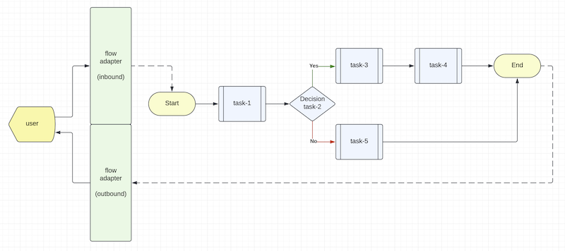
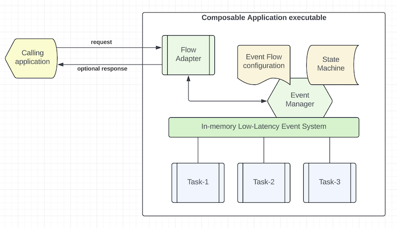

# Introduction

The high level concept of composable architecture was advocated by Gartner in 2022.

At the platform level, composable architecture refers to loosely coupled platform services, utilities, and
business applications. With modular design, you can assemble platform components and applications to create
new use cases or to adjust for ever-changing business environment and requirements. Domain driven design (DDD),
Command Query Responsibility Segregation (CQRS) and Microservices patterns are the popular tools that architects
use to build composable architecture. You may deploy application in container, serverless or other means.

At the application level, composable application means that an application is assembled from modular software
components or functions that are self-contained and pluggable. You can mix-n-match functions to form new applications.
You can retire outdated functions without adverse side effect to a production system. Multiple versions of a function
can exist, and you can decide how to route user requests to different versions of a function. Applications would be
easier to design, develop, maintain, deploy, and scale.

In 2023, Accenture extended its event-driven development framework, codename "Mercury", to become the first
implementation of a Composable framework to realize the goal of composable architecture and application design.

Before we take a deep dive of the mercury-composable framework, let's review Composable Methodology first.

# Methodology

The Composable Methodology takes a different approach in software development that empowers and aligns product owners,
business analysts, technology architects and software engineers.

Historically, there is a disconnect between product features and application design because product is user and
business focused but application design is technology oriented. Product owners have almost no direct control over
the quality of the user applications that are supposed to address business requirements. There is a communication
barrier between the two domains in most projects. It requires a lot of iterations to get things right. The lack of
direct connection between business domain and technical domain also leads to higher technical debts that are not just
limited to imperfect coding.

Composable methodology addresses this fundamental issue by connecting the two domains seamlessly.

Before developers write a line of code, we start a project from product design. The output from a product design
is a business transaction event flow diagram, ideally from a tactical Event Storming workshop or a more relaxed
white boarding discussion among product owners, business domain experts and technology architects.

> Figure 1 - Event Flow Diagram



As shown in Figure 1, a transaction flow diagram has a start point and an end point. Each processing step is called
a "task". Some tasks would do calculation and some tasks would make decision to pass to the next steps.

> *Note*: Task types include decision, response, end, sequential, parallel, fork-n-join, sink and pipeline.

The product team designs a transaction flow to address a business use case and presents it as a diagram.
Naturally, this is how a human designer thinks. We don't want to prematurely adjust the business requirements
to any infrastructural limitation.

## Events at the center of the modern enterprise

In Domain Driven Design, it is well accepted that business transactions and their intermediate objects can be
represented as "events".

An event is a holder of a business object that may be a transaction request, a transaction response, a data object
or any intermediate data representation. Generally, a data object is a structure of key-values.

For simplicity, we will call a transaction flow diagram as "Event Flow Diagram" from now on.

## First principle - "input-process-output"

The first principle of composable application design is that each task (also called "function") is self-contained
and its input and output are immutable.

Self-containment means that the task or function does not need to know the world outside its functional scope, thus
making the function as pure as "input-process-output". i.e. given some input, the task or function will carry out
some business logic to generate some output according to functional specification.

Immutability is an important guardrail for clean code design. A function cannot change the business object outside
its functional scope, thus eliminating the chance of unintended side effects of data interference.

> *Note*: In composable design, task and function can be used interchangeably. In an event flow diagram, we call each
  step a "task". In application design, we call each step a "function".

## Second principle - zero to one dependency

The second principle is that each function should have zero dependency with other user functions.

To connect to the world outside its functional scope, a function may have one and only one dependency with a platform
or infrastructure component function. In composable design, a library can be packaged as a reusable composable
function.

A function consumes a platform component or library by sending an event to the component instead of tight coupling
with a direct method call. Decoupling between functions and components promotes non-blocking, asynchronous and
parallel operation that yields higher performance and throughput.

## Third principle - platform abstraction

Since composable functions are self-contained and independent, they can be reused and repackaged into different
applications to serve different purposes. Therefore, composable functions are, by definition, plug-n-play.

The platform and infrastructure layers are encapsulated as `adapters`, `gateways` and `wrappers`.
Figure 1 illustrates this architectural principle by connecting an event flow to the user through an event flow
adapter. For example, a "HTTP Flow Adapter" serves both inbound request and outbound response. A "Kafka Flow Adapter"
uses one topic for inbound and another topic for outbound events.

## Fourth principle - event choreography

Without direct coupling, a composable development framework must support "Event Choreography" so that we can
connect the various user composable functions, platform components and libraries together and route the events
according to an event flow diagram for each use case.

## Application development

Once we have drawn the event flow diagrams for different use cases, we can create user stories for each composable
function and assign the development of each function to a developer or a pair of developers if using pair-programming.

Composable methodology embraces "Test Driven Development (TDD)". Since each function is self-contained, it is TDD
friendly because the developer does not need to deal with external dependencies for unit tests. It is the first
principle of "input-process-output".

This methodology allows us to scale our application development resources much better than traditional approach
because developers do not need to know details of dependencies, thus avoiding hard code and reducing technical debts.

For integration tests, it is easy to mock platform, infrastructure, database and HTTP resources by assigning
mock functions to some tasks in an event flow. This greatly simplifies integration mocking.

## Seamless transition from product to application design

Event flow diagram describes the product and each composable function contains the specific processing logic.
Data attributes in an event flowing from one function to another provide the clarity for product designers and
application engineers to communicate effectively.

## Application packaging and deployment

Composable functions are independent and isolated. We can package related functions for an event flow in a single
executable. A senior developer or architect can decide how to package related functions to reduce memory footprint
and to scale efficiently and horizontally.

## Smaller memory footprint

By design, composable functions are granular in nature. They are registered to an "event loop" on-demand. i.e.
a function is executed when an event arrives. Without multiple levels of tight coupling, each piece of user code
consumes memory efficiently. Memory is released to the system as soon as the function finishes execution.

# Composable framework

To realize the composable design principles, a low-latency in-memory event system is available at the core
of the Mercury-Composable framework.

> Figure 2 - Composable Framework



As illustrated in Figure 2, event choreography for an event flow is described as an "Event Flow Configuration".
An "Event Manager" is implemented as part of a low-latency in-memory event system. Composable functions
(aka "task" in an event flow) ride on the in-memory event system so that the event manager can invoke them by
sending events.

Since composable functions are self-contained, the event manager performs input/output data mapping to and from
the functional scope of a composable function. This flexible data mapping allows developers to write more generic
code that responds to different input dataset, thus promoting software reusability.

An in-memory state machine will be created for each execution of a transaction or "event flow". It is used for holding
transaction "states" and temporary data objects.

Sometimes a transaction may be suspended and restarted with different event flows. The in-memory state machine can
be extended to an external datastore so that transaction states can be monitored and recovered operationally.

> *Note*: In Java, we combine the use of native Java 21 virtual thread management with Eclipse Vertx event bus.
  In Node.js, we use the EventEmitter event bus from the standard library.

## Event Envelope

We use a standard "Event Envelope" to transport an event over the in-memory event bus. An event envelope contains
three parts: (1) body, (2) headers and (3) metadata.

Event body is used to transport a business object. In Java, it may be a PoJo or a HashMap. In node.js, it is a JSON
object.

Headers can be used to carry additional parameters to tell the user composable function what to do.

Examples for metadata include performance metrics, status, exception, optional tracing information, and
correlation ID.

## Language neutral

The event flow configuration syntax and event envelope serialization scheme are standardized for polyglot deployment.
The event flow configuration rides on YAML and event envelope serialization uses binary JSON ("MsgPack").

For higher serialization efficiency, the intermediate format is using "key-value" maps. JSON string is only used at
the inbound and outbound flow adapters.

## Functional isolation

Each function must implement the Composable interface. In Java, it is called "TypedLambdaFunction".
In Node.js, it is called "Composable".

The composable interface enforces a single "handleEvent" method where the function can access the event's headers
and body.

By design, each composable function is invoked by events. It is running parallel with other user functions.
This non-blocking asynchronous execution architecture delivers higher performance than traditional coding approach
with direct method invocation.

While each function is executed in an event-driven and reactive manner, the user application code inside each
composable function may use any coding style including object-oriented design, functional or reactive.

Functional isolation means that you can use any open source or commercial library or framework in your user
function without concerns about thread safety or unintended side effect.

In Java, a composable function may look like this:

```java
@PreLoad(route = "my.first.function", instances = 10)
public class MyFirstFunction implements TypedLambdaFunction<MyPoJo, AnotherPoJo> {

    @Override
    public AnotherPojo handleEvent(Map<String, String> headers, MyPoJo input, int instance) {
        // your business logic here
        return result;
    }
}
```

In Node.js, it may look like this:

```java
export class MyFirstFunction implements Composable {

    @preload('my.first.function', 10)
    initialize(): Composable {
        return this;
    }

    async handleEvent(evt: EventEnvelope) {
        // your business logic here
        return result;
    }
```

A composable function is declared with a "route name" using the "preload" annotation. While Java
and Node.js has different syntax for annotation, they use a similar declarative approach.

> *Note*: the "instance" count for each composable function controls execution concurrency in a single application.
  It can be used with horizontal scaling to optimize use of computing resources.
<br>

|                   Home                    |          Chapter-1           |
|:-----------------------------------------:|:----------------------------:|
| [Table of Contents](TABLE-OF-CONTENTS.md) | [Introduction](CHAPTER-1.md) |

